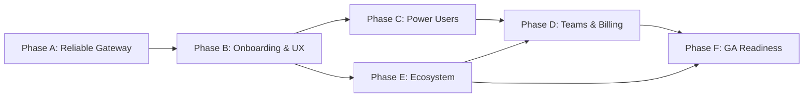

# Product Roadmap: KorProxy

## Vision
Enable developers to seamlessly use their existing AI subscriptions (Claude Pro, ChatGPT Plus, Google AI) with any AI coding tool through a reliable, local proxy gateway.

## Current State
- **Version**: Pre-1.0 (Active Development)
- **Status**: Active Development
- **Last Updated**: 2025-12-17

## Success Metrics

| Metric | Target | Category |
|--------|--------|----------|
| Time-to-first proxied request | < 10 minutes | Onboarding |
| Onboarding completion rate | > 70% | Onboarding |
| Successful proxied requests (7d) | > 99.0% | Reliability |
| Crash-free sessions | > 99.5% | Reliability |
| Free-to-paid conversion | > 5-10% | Business |
| Monthly paid churn | < 5% | Business |

---

## Milestones

### Phase A: Reliable Local Gateway (Target: Jan 2026)
**Goal**: Ship KorProxy 1.0 as a rock-solid, no-surprises bridge between coding tools and AI providers.

**Features**:
- [ ] Provider support parity (Gemini, Claude, Codex, Qwen, iFlow) - `spec: provider-parity`
- [ ] Hardened Go sidecar lifecycle (health checks, auto-recovery) - `spec: sidecar-reliability`
- [ ] Integration presets for Cursor, Cline, Windsurf - `spec: tool-integrations`
- [ ] Telemetry & crash handling (Sentry integration) - `spec: telemetry`
- [ ] In-app "Run test request" for each provider - `spec: provider-testing`

**Success Criteria**:
- Proxy uptime > 99% during internal testing
- E2E test success rate ≥ 99% per provider
- 3+ tools tested with 2+ providers each
- < 2 proxy-related tickets per 50 users

---

### Phase B: Delightful Onboarding & UX (Target: Feb 2026)
**Goal**: Make KorProxy trivially easy to set up with coding tools and understand what's happening.

**Features**:
- [ ] First-run onboarding wizard (tool selection → provider → test) - `spec: onboarding-wizard`
- [ ] Refined OAuth/API key flows with clear error states - `spec: auth-ux`
- [ ] Framer Motion page transitions & micro-interactions - `spec: ui-polish`
- [ ] Dark/light theme toggle with persistence - `spec: theming`
- [ ] Setup guides on korproxy-web (`/guides/<tool>-setup`) - `spec: setup-guides`
- [ ] Troubleshooting & security docs - `spec: documentation`

**Success Criteria**:
- Onboarding success rate > 75%
- Median install → first request < 7 minutes
- < 10% drop-off during provider connection
- < 10% drop-off during tool configuration

---

### Phase C: Power Users & Routing Intelligence (Target: Apr 2026)
**Goal**: Make KorProxy the best tool for heavy users managing multiple providers and accounts.

**Features**:
- [ ] Per-provider routing rules (code completion → fast model, chat → capable model) - `spec: routing-rules`
- [ ] Multi-account load balancing (round-robin, quota-aware) - `spec: load-balancing`
- [ ] Workspace profiles with per-project settings - `spec: profiles`
- [ ] Quick profile switching from system tray - `spec: tray-profiles`
- [ ] Local usage analytics dashboard - `spec: local-analytics`
- [ ] Optional web sync for aggregate metrics - `spec: cloud-sync`

**Success Criteria**:
- ≥ 30% of active users with multiple providers
- Power user satisfaction ≥ 4/5 on routing
- Proxy latency overhead < 80ms p50, < 200ms p95
- Error rate per provider ≤ 1%

---

### Phase D: Teams, Billing & Web Dashboard (Target: Jul 2026)
**Goal**: Turn KorProxy into a sustainable product with subscriptions and team functionality.

**Features**:
- [ ] Stripe Checkout/Portal integration - `spec: stripe-integration`
- [ ] Subscription lifecycle (trials, cancelation, reactivation) - `spec: subscription-lifecycle`
- [ ] Plan tiers: Free, Pro, Team - `spec: pricing-tiers`
- [ ] Desktop subscription enforcement with graceful degradation - `spec: subscription-enforcement`
- [ ] Multi-device account sync - `spec: device-sync`
- [ ] Team invites, seat management, roles - `spec: team-management`
- [ ] Web dashboard (usage, billing, team admin) - `spec: web-dashboard`

**Success Criteria**:
- Paid conversion ≥ 5-10% of active users
- Monthly churn < 5%
- At least 2 live team accounts
- Billing error rate < 1 per 500 events

---

### Phase E: Ecosystem & Growth (Ongoing from Mar 2026) ✅
**Goal**: Grow adoption via integrations, content, and partnerships.

**Features**:
- [x] JetBrains, VS Code, NeoVim/Emacs integration guides - `spec: editor-guides`
- [x] New provider support as CLIProxyAPI expands - `spec: provider-expansion`
- [x] In-app feedback with context (logs, provider, model) - `spec: feedback-system`
- [x] Public roadmap & changelog on korproxy-web - `spec: public-roadmap`
- [x] Marketing content (blog posts, landing page optimization) - `spec: marketing-content`

**Success Criteria**:
- Organic traffic growing > 20% MoM for first 6 months
- ≥ 30% of users via guides/blog posts
- GitHub closed/created issue ratio > 1

---

### Phase F: GA Readiness & Production Hardening (Target: Sep 2026)
**Goal**: Make KorProxy a stable, observable, and automatable 1.0 that teams can depend on daily.

**Features**:
- [ ] E2E test coverage for all 5 providers with CI gates - `spec: e2e-coverage`
- [ ] Local-first diagnostics (correlation IDs, debug bundles, metrics dashboard) - `spec: local-diagnostics`
- [ ] Performance optimization (connection pooling, startup time, memory) - `spec: performance`
- [ ] Admin & support tools (admin dashboard, safe mode, error codes) - `spec: admin-tools`
- [ ] Stable versioned API/CLI for automation - `spec: api-cli`

**Success Criteria**:
- E2E test success rate ≥ 99% per provider
- Crash-free sessions > 99.5%
- Request latency overhead < 50ms p50, < 100ms p95
- Time to diagnose issue < 5 minutes

---

## Dependencies

---

## Immediate Next Steps (Weeks 1-3)

### Week 1
- [ ] Instrument basic telemetry in desktop app
- [ ] Write automated smoketests for each provider against localhost:1337
- [ ] Verify current implementation status vs PROJECT_PLAN.md

### Week 2
- [ ] Implement "Test connection" screen in desktop app
- [ ] Add first polished guide page (Cursor + Claude Pro)

### Week 3
- [ ] Design first-run onboarding wizard
- [ ] Create GitHub milestones mirroring this roadmap
- [ ] Define Phase A exit criteria

---

## Risks & Mitigations

| Risk | Impact | Likelihood | Mitigation |
|------|--------|------------|------------|
| Provider API changes break proxy | High | Medium | Version contracts, automated provider tests |
| OAuth token expiration UX confusion | Medium | High | Clear error states, proactive refresh |
| Coding tool config changes | Medium | Medium | Versioned guides, auto-detect settings |
| Performance overhead complaints | Medium | Low | Benchmark continuously, optimize critical paths |
| Stripe webhook failures | High | Low | Idempotent handlers, manual admin override |

---

## Technical Debt & Gaps

### Identified Gaps (from analysis)
- E2E tested flows for all 5 providers including edge cases
- Guided onboarding for dev tools
- Robust log viewer and troubleshooting UX
- In-app telemetry (crash/error tracking)
- Full Stripe webhook lifecycle
- Admin tools for support overrides

### Backend Schema (korproxy-backend)
Current tables: `users`, `sessions`, `subscriptionEvents`
Fields: `stripeCustomerId`, `stripeSubscriptionId`, `subscriptionStatus`

---

## Notes
- Timelines assume 1-2 full-time engineers
- CLIProxyAPI is a git submodule - coordinate API version contracts
- Proxy runs on localhost:1337
- macOS/Windows code signing already configured in CI
