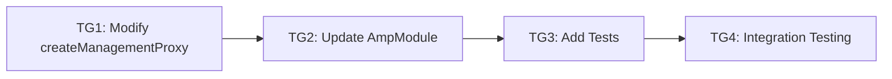

# Tasks: Amp Management Route Authentication Fix

> **Spec**: [spec.md](spec.md)
> **Created**: 2024-12-18
> **Status**: Complete

---

## Task Overview



| Group | Name | Dependencies | Status |
|-------|------|--------------|--------|
| TG1 | Modify createManagementProxy | None | ✅ |
| TG2 | Update AmpModule to pass SecretSource | TG1 | ✅ |
| TG3 | Add Unit Tests | TG2 | ✅ |
| TG4 | Integration & Regression Testing | TG3 | ✅ |

---

## Task Group 1: Modify createManagementProxy

**Dependencies**: None
**Estimated**: 30 minutes
**File**: `CLIProxyAPI/internal/api/modules/amp/proxy.go`

### Implementation
- [ ] Update `createManagementProxy` signature to accept `SecretSource` parameter
- [ ] In Director function, strip client's `Authorization` header
- [ ] In Director function, strip client's `X-Api-Key` header
- [ ] Look up Amp token from SecretSource
- [ ] If token found, set `Authorization: Bearer <token>` and `X-Api-Key: <token>`
- [ ] Add error handling if SecretSource lookup fails
- [ ] Add debug logging for auth decision (without logging token value)

### Code Changes
```go
// Before:
func createManagementProxy(upstreamURL string) (*httputil.ReverseProxy, error)

// After:
func createManagementProxy(upstreamURL string, secretSource SecretSource) (*httputil.ReverseProxy, error)
```

### Acceptance Criteria
- Management proxy injects Amp token from SecretSource
- Client's auth headers are stripped
- Token value is never logged

---

## Task Group 2: Update AmpModule to Pass SecretSource

**Dependencies**: TG1
**Estimated**: 15 minutes
**File**: `CLIProxyAPI/internal/api/modules/amp/amp.go`

### Implementation
- [ ] Update `enableUpstreamProxy` to pass `m.secretSource` to `createManagementProxy`
- [ ] Update `OnConfigUpdated` to handle management proxy recreation if needed
- [ ] Ensure SecretSource is initialized before management proxy creation

### Code Changes
```go
// In enableUpstreamProxy():
// Before:
mgmtProxy, err := createManagementProxy(upstreamURL)

// After:
mgmtProxy, err := createManagementProxy(upstreamURL, m.secretSource)
```

### Acceptance Criteria
- Management proxy receives valid SecretSource
- Hot-reload of Amp token works for management routes

---

## Task Group 3: Add Unit Tests

**Dependencies**: TG2
**Estimated**: 45 minutes
**File**: `CLIProxyAPI/internal/api/modules/amp/proxy_test.go`

### Tests First (5 tests)
- [ ] Test: `TestCreateManagementProxy_InjectsToken` - Verify token is injected when available
- [ ] Test: `TestCreateManagementProxy_StripsClientAuth` - Verify client Authorization is removed
- [ ] Test: `TestCreateManagementProxy_StripsClientApiKey` - Verify client X-Api-Key is removed
- [ ] Test: `TestCreateManagementProxy_NoTokenContinues` - Verify request proceeds when no token (ampcode.com will reject)
- [ ] Test: `TestCreateManagementProxy_PreservesOtherHeaders` - Verify non-auth headers pass through

### Verification
- [ ] Run tests: `go test ./internal/api/modules/amp/... -v -run "TestCreateManagementProxy"`
- [ ] All new tests pass

### Acceptance Criteria
- All 5 new tests implemented and passing
- Tests verify both positive and negative cases

---

## Task Group 4: Integration & Regression Testing

**Dependencies**: TG3
**Estimated**: 30 minutes

### Tests
- [ ] Run full amp module tests: `go test ./internal/api/modules/amp/... -v`
- [ ] Run full project build: `go build ./...`
- [ ] Verify existing tests still pass (regression)

### Manual Testing (if KorProxy instance available)
- [ ] Configure valid `ampcode.upstream-api-key`
- [ ] Test thread reading via Amp CLI
- [ ] Test web search via Amp CLI
- [ ] Test provider routes still work (regression)

### Verification
- [ ] All existing tests pass
- [ ] No regressions in provider route behavior
- [ ] Build succeeds

### Acceptance Criteria
- All amp module tests pass
- Project builds successfully
- No regressions detected

---

## Final Checklist

- [ ] All task groups complete
- [ ] All tests passing: `go test ./internal/api/modules/amp/... -v`
- [ ] Build succeeds: `go build ./...`
- [ ] Code follows existing patterns
- [ ] No sensitive data logged
- [ ] Documentation updated (analysis doc exists)
- [ ] Ready for verification phase
