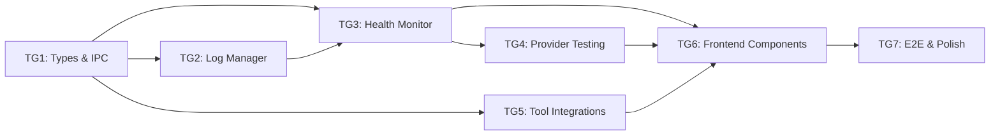

# Tasks: Phase A - Reliable Local Gateway

> **Spec**: [spec.md](spec.md)
> **Created**: 2025-12-17
> **Status**: Not Started

---

## Task Overview



| Group | Name | Dependencies | Estimate | Status |
|-------|------|--------------|----------|--------|
| TG1 | Types & IPC Channels | None | 1.5h | ⬜ |
| TG2 | Log Manager | TG1 | 2h | ⬜ |
| TG3 | Health Monitor | TG1, TG2 | 3h | ⬜ |
| TG4 | Provider Testing | TG3 | 2h | ⬜ |
| TG5 | Tool Integrations | TG1 | 2h | ⬜ |
| TG6 | Frontend Components | TG3, TG4, TG5 | 3h | ⬜ |
| TG7 | E2E Tests & Polish | TG6 | 2h | ⬜ |

**Total Estimate**: ~15.5 hours

---

## Task Group 1: Types & IPC Channels

**Dependencies**: None
**Estimated**: 1.5 hours
**Files**: `electron/common/ipc-types.ts`, `electron/common/ipc-channels.ts`

### Tests First
- [ ] Test: `HealthState` enum has all 6 states (stopped, starting, healthy, degraded, unreachable, failed)
- [ ] Test: `HealthStatus` interface validates with Zod
- [ ] Test: `ProviderTestResult` interface validates with Zod
- [ ] Test: `ToolIntegration` interface validates with Zod
- [ ] Test: `LogEntry` interface validates with Zod
- [ ] Test: New IPC channel constants are unique

### Implementation
- [ ] Add `HealthState` enum to `ipc-types.ts`:
  ```typescript
  export enum HealthState {
    STOPPED = 'stopped',
    STARTING = 'starting',
    HEALTHY = 'healthy',
    DEGRADED = 'degraded',
    UNREACHABLE = 'unreachable',
    FAILED = 'failed'
  }
  ```
- [ ] Add `HealthStatus` interface: `{ state, lastCheck, consecutiveFailures, restartAttempts }`
- [ ] Add `ProviderTestResult` interface: `{ providerId, success, latencyMs?, errorCode?, errorMessage?, timestamp }`
- [ ] Add `ToolIntegration` interface: `{ toolId, displayName, detected, configPath?, configSnippet, instructions }`
- [ ] Add `LogEntry` interface: `{ timestamp, level, message, context?, source? }`
- [ ] Add `LogLevel` type: `'debug' | 'info' | 'warn' | 'error'`
- [ ] Add new IPC channels:
  - `PROXY_HEALTH` - health state updates
  - `PROVIDER_TEST_RUN` - run provider test
  - `TOOL_INTEGRATION_LIST` - list tool integrations
  - `TOOL_INTEGRATION_COPY` - copy config to clipboard
  - `LOGS_GET` - retrieve logs
  - `LOGS_EXPORT` - export all logs
  - `LOGS_CLEAR` - clear logs
- [ ] Add Zod schemas for all new types
- [ ] Add `PROVIDER_DEFAULT_MODELS` config map

### Verification
- [ ] Run tests: `bun run test -- --grep "ipc-types"`
- [ ] TypeScript compiles: `bun run typecheck`

### Acceptance Criteria
- All new types exported and usable in main/renderer
- Zod schemas match TypeScript interfaces
- No breaking changes to existing types

---

## Task Group 2: Log Manager

**Dependencies**: TG1
**Estimated**: 2 hours
**Files**: `electron/main/log-manager.ts`

### Tests First
- [ ] Test: Log file created in app data directory on first log
- [ ] Test: Log entries are valid JSON lines format
- [ ] Test: `cleanup()` deletes files older than 24 hours
- [ ] Test: `cleanup()` keeps files newer than 24 hours
- [ ] Test: All log levels (debug, info, warn, error) write correctly
- [ ] Test: `getLogs()` returns entries filtered by level
- [ ] Test: `exportLogs()` returns all logs as string

### Implementation
- [ ] Create `electron/main/log-manager.ts` with `LogManager` class:
  ```typescript
  class LogManager {
    private logDir: string
    
    log(level: LogLevel, message: string, context?: object): void
    cleanup(): Promise<void>  // Delete logs > 24h old
    getLogs(options?: { since?: Date, level?: LogLevel }): Promise<LogEntry[]>
    exportLogs(): Promise<string>
    clear(): Promise<void>
  }
  ```
- [ ] Log file location: `{app.getPath('userData')}/logs/korproxy-{YYYY-MM-DD}.log`
- [ ] Log format: JSON lines (one JSON object per line)
- [ ] Each entry: `{ timestamp: ISO, level, message, context?, source? }`
- [ ] Run `cleanup()` on app start
- [ ] Export singleton instance `logManager`
- [ ] Add IPC handlers in `ipc.ts`:
  - `LOGS_GET` → `logManager.getLogs()`
  - `LOGS_EXPORT` → `logManager.exportLogs()`
  - `LOGS_CLEAR` → `logManager.clear()`

### Verification
- [ ] Run tests: `bun run test -- --grep "log-manager"`
- [ ] Manual: Check log file created in correct location
- [ ] Manual: Verify JSON format is valid

### Acceptance Criteria
- Logs written to correct location
- Auto-cleanup removes old logs
- Export produces valid downloadable content

---

## Task Group 3: Health Monitor

**Dependencies**: TG1, TG2
**Estimated**: 3 hours
**Files**: `electron/main/health-monitor.ts`, `electron/main/sidecar.ts`, `electron/main/ipc.ts`

### Tests First
- [ ] Test: `stopped` → `starting` on start()
- [ ] Test: `starting` → `healthy` after grace period + successful check
- [ ] Test: `healthy` → `degraded` when latency > 500ms
- [ ] Test: `healthy` → `degraded` on 1-2 consecutive failures
- [ ] Test: `degraded` → `unreachable` on 3 consecutive failures
- [ ] Test: `unreachable` → `starting` triggers auto-restart (attempts < 3)
- [ ] Test: `unreachable` → `failed` when restart attempts exhausted
- [ ] Test: Grace period delays health checks for 5 seconds

### Implementation
- [ ] Create `electron/main/health-monitor.ts`:
  ```typescript
  class HealthMonitor extends EventEmitter {
    constructor(sidecar: ProxySidecar, port: number)
    start(): void      // Begin grace period, then polling
    stop(): void       // Clear timers
    getStatus(): HealthStatus
    resetRestartAttempts(): void
  }
  ```
- [ ] Implement state machine with all transitions from spec
- [ ] Health check: HTTP GET `/v0/management/usage` with 2s timeout
- [ ] Polling interval: 10 seconds (after 5s grace period)
- [ ] Auto-restart logic: max 3 attempts, then `failed` state
- [ ] Emit events: `stateChange(HealthStatus)`
- [ ] Log all state transitions via `logManager`
- [ ] **Remove** existing auto-restart logic from `sidecar.ts` (lines 100-112)
- [ ] Add port conflict detection before start
- [ ] Add config file validation before start
- [ ] Add `PROXY_HEALTH` IPC handler to push state to renderer
- [ ] Integrate with app lifecycle (clean shutdown)

### Verification
- [ ] Run tests: `bun run test -- --grep "health-monitor"`
- [ ] Manual: Start proxy, verify health shows green
- [ ] Manual: Kill sidecar process, verify auto-restart

### Acceptance Criteria
- Health monitor tracks proxy state correctly
- Auto-restart works up to 3 times
- No orphan processes on app quit
- State changes logged

---

## Task Group 4: Provider Testing

**Dependencies**: TG3
**Estimated**: 2 hours
**Files**: `electron/main/provider-test.ts`, `electron/main/ipc.ts`

### Tests First
- [ ] Test: Builds correct payload for Claude (`/v1/messages` format)
- [ ] Test: Builds correct payload for OpenAI/Codex (`/v1/chat/completions`)
- [ ] Test: Builds correct payload for Gemini
- [ ] Test: Returns `PROXY_NOT_RUNNING` error when proxy stopped
- [ ] Test: Returns `TIMEOUT` error after 30 seconds
- [ ] Test: Measures latency within 100ms accuracy

### Implementation
- [ ] Create `electron/main/provider-test.ts`:
  ```typescript
  async function runProviderTest(
    providerId: string,
    modelId?: string
  ): Promise<ProviderTestResult>
  ```
- [ ] Get default model from `PROVIDER_DEFAULT_MODELS` if not specified
- [ ] Build minimal test payload:
  ```json
  { "model": "...", "messages": [{"role": "user", "content": "Say OK"}], "max_tokens": 10 }
  ```
- [ ] Send to `http://localhost:{port}/v1/chat/completions`
- [ ] Measure latency from request start to response
- [ ] Map errors to standard codes:
  - `PROXY_NOT_RUNNING` - Sidecar not available
  - `TOKEN_EXPIRED` - OAuth token needs refresh
  - `QUOTA_EXCEEDED` - Rate limit hit
  - `NETWORK_ERROR` - Connection failed
  - `PROVIDER_ERROR` - Upstream error
  - `TIMEOUT` - Request exceeded 30s
- [ ] Add `PROVIDER_TEST_RUN` IPC handler with Zod validation
- [ ] Log test results via `logManager`

### Verification
- [ ] Run tests: `bun run test -- --grep "provider-test"`
- [ ] Manual: Run test for connected provider, verify success
- [ ] Manual: Disconnect provider, run test, verify clear error

### Acceptance Criteria
- Test works for all 5 providers
- Latency displayed accurately
- Error messages are actionable

---

## Task Group 5: Tool Integrations

**Dependencies**: TG1
**Estimated**: 2 hours
**Files**: `electron/main/tool-integrations.ts`, `electron/main/ipc.ts`

### Tests First
- [ ] Test: Cline config snippet is valid JSON
- [ ] Test: Continue.dev config snippet is valid JSON
- [ ] Test: `detectTool('cline')` returns true when VS Code settings exist
- [ ] Test: `detectTool('continue')` returns true when ~/.continue exists
- [ ] Test: `getConfigSnippet()` substitutes port correctly
- [ ] Test: Copy to clipboard works

### Implementation
- [ ] Create `electron/main/tool-integrations.ts`:
  ```typescript
  const TOOL_CONFIGS: Record<string, ToolConfig> = {
    cline: {
      id: 'cline',
      displayName: 'Cline',
      configPaths: {
        darwin: '~/Library/Application Support/Code/User/settings.json',
        linux: '~/.config/Code/User/settings.json',
        win32: '%APPDATA%/Code/User/settings.json'
      },
      configSnippet: '...',
      instructions: '...'
    },
    continue: {
      id: 'continue',
      displayName: 'Continue.dev',
      configPaths: { darwin: '~/.continue', linux: '~/.continue', win32: '~/.continue' },
      configSnippet: '...',
      instructions: '...'
    }
  }
  
  function detectTool(toolId: string): Promise<boolean>
  function getToolIntegrations(): Promise<ToolIntegration[]>
  function getConfigSnippet(toolId: string, port: number): string
  ```
- [ ] Config snippets from spec section 4.2
- [ ] Instructions for each tool (step-by-step setup)
- [ ] Add IPC handlers:
  - `TOOL_INTEGRATION_LIST` → `getToolIntegrations()`
  - `TOOL_INTEGRATION_COPY` → copy snippet to clipboard via `clipboard.writeText()`

### Verification
- [ ] Run tests: `bun run test -- --grep "tool-integration"`
- [ ] Manual: Copy Cline config, paste into VS Code
- [ ] Manual: Verify detection when VS Code installed

### Acceptance Criteria
- Config snippets work with Cline and Continue.dev
- Detection identifies installed tools
- Copy button works reliably

---

## Task Group 6: Frontend Components

**Dependencies**: TG3, TG4, TG5
**Estimated**: 3 hours
**Files**: `src/components/`, `src/hooks/`, `src/pages/`

### Tests First
- [ ] Test: `useHealthStatus` hook returns current state
- [ ] Test: `HealthStatusBadge` renders correct color per state
- [ ] Test: `ProviderTestButton` shows loading during test
- [ ] Test: `ProviderTestButton` displays latency on success
- [ ] Test: `ToolIntegrationCard` renders copy button

### Implementation
- [ ] Create `src/hooks/useHealthStatus.ts`:
  ```typescript
  function useHealthStatus(): HealthStatus
  // Subscribe to PROXY_HEALTH IPC events
  // Cleanup on unmount
  ```
- [ ] Create `src/components/dashboard/HealthStatusBadge.tsx`:
  - Colors: green (healthy), yellow (degraded/starting), red (unreachable/failed), gray (stopped)
  - Tooltip with last check time and failure count
  - Pulse animation on state change
- [ ] Update Dashboard to show `HealthStatusBadge`
- [ ] Create `src/components/providers/ProviderTestButton.tsx`:
  - "Run Test" button with loading spinner
  - Result display: ✓ 420ms or ✗ Error message
  - Last test timestamp
- [ ] Add test buttons to Providers page for each connected provider
- [ ] Create `src/components/integrations/ToolIntegrationCard.tsx`:
  - Tool icon and name
  - Detection status badge (Detected / Not Detected)
  - "Copy Config" button
  - Expandable instructions
- [ ] Create `src/pages/Integrations.tsx` or add section to Settings:
  - List all tool integration cards
  - Show proxy port in snippets
- [ ] Create `src/components/logs/LogViewer.tsx` (P1):
  - Filter by level (debug/info/warn/error)
  - Filter by time range
  - Export button

### Verification
- [ ] Run tests: `bun run test -- --grep "components"`
- [ ] Visual: Verify all health states render correctly
- [ ] Manual: Full UI walkthrough

### Acceptance Criteria
- Health status always visible on dashboard
- Provider test easy to find and use
- Tool integration clear with working copy

---

## Task Group 7: E2E Tests & Polish

**Dependencies**: TG6
**Estimated**: 2 hours
**Files**: `e2e/`

### Tests First (E2E)
- [ ] E2E: Start app → Start proxy → Health shows green
- [ ] E2E: Start proxy → Kill sidecar → Auto-restart → Health green
- [ ] E2E: Sidecar crashes 3x → "Proxy Failed" state shown
- [ ] E2E: Test provider → Success with latency displayed
- [ ] E2E: Tool integrations → Copy config → Clipboard has content
- [ ] E2E: Manual restart from failed state works

### Implementation
- [ ] Write Playwright E2E tests for all scenarios above
- [ ] Add provider smoketest script `scripts/smoketest-providers.ts`:
  - Start proxy
  - Run test for each provider
  - Report results (soft-fail on provider outages)
- [ ] Polish: Loading skeletons where needed
- [ ] Polish: Error states have clear messaging
- [ ] Polish: Keyboard shortcuts (Cmd+R to restart proxy)
- [ ] Documentation: Update README with new features
- [ ] Documentation: Add troubleshooting section

### Verification
- [ ] Run E2E: `bun run test:e2e`
- [ ] Run full test suite: `bun run test`
- [ ] Manual walkthrough of all features

### Acceptance Criteria
- All E2E tests pass
- No regressions in existing functionality
- Documentation up to date

---

## Final Checklist

- [ ] All task groups complete
- [ ] All tests passing: `bun run test && bun run test:e2e`
- [ ] TypeScript compiles: `bun run typecheck`
- [ ] Lint passes: `bun run lint`
- [ ] Code reviewed
- [ ] Documentation updated
- [ ] Ready for verification phase

---

## Notes

### Decisions
- **Log format**: JSON lines (one object per line) for easy parsing
- **Log retention**: 24 hours, cleanup on app start
- **Health polling**: 10s interval, 5s grace period after start
- **Restart limit**: 3 attempts before `failed` state

### Existing Code to Preserve
- Amp CLI integration (`INTEGRATIONS_AMP_*` handlers)
- Factory Droid CLI integration (`INTEGRATIONS_FACTORY_*` handlers)
- All existing IPC handlers and types
