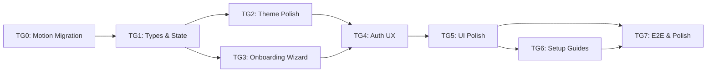

# Tasks: Phase B - Delightful Onboarding & UX

> **Spec**: [spec.md](spec.md)
> **Created**: 2025-12-17
> **Status**: Not Started

---

## Task Overview



| Group | Name | Dependencies | Estimate | Status |
|-------|------|--------------|----------|--------|
| TG0 | Motion Library Migration | None | 0.5h | ⬜ |
| TG1 | Types & Onboarding State | TG0 | 1.5h | ⬜ |
| TG2 | Theme Polish | TG1 | 2h | ⬜ |
| TG3 | Onboarding Wizard | TG1 | 4h | ⬜ |
| TG4 | Auth UX Enhancement | TG2, TG3 | 3h | ⬜ |
| TG5 | UI Polish & Transitions | TG4 | 2.5h | ⬜ |
| TG6 | Setup Guides (Web) | TG5 | 3h | ⬜ |
| TG7 | E2E Tests & Integration | TG5, TG6 | 2h | ⬜ |

**Total Estimate**: ~18.5 hours

---

## Task Group 0: Motion Library Migration

**Dependencies**: None
**Estimated**: 0.5 hours
**Files**: `package.json`, 19 source files with `framer-motion` imports

### Background
As of November 2024, Framer Motion was renamed to **Motion** and became independent from Framer. The library is now published as `motion` on npm with React imports from `motion/react`. The API remains compatible with Framer Motion v11.

### Implementation
- [ ] Update `package.json`:
  ```bash
  cd korproxy-app
  npm uninstall framer-motion
  npm install motion
  ```
- [ ] Update all imports (19 files):
  ```typescript
  // Before
  import { motion, AnimatePresence } from 'framer-motion'
  
  // After
  import { motion, AnimatePresence } from 'motion/react'
  ```
- [ ] Files to update:
  - `src/pages/Providers.tsx`
  - `src/pages/Accounts.tsx`
  - `src/pages/Logs.tsx`
  - `src/pages/Dashboard.tsx`
  - `src/pages/Settings.tsx`
  - `src/components/shared/Toast.tsx`
  - `src/components/shared/ThemeToggle.tsx`
  - `src/components/shared/AnimatedCounter.tsx`
  - `src/components/shared/ErrorFallback.tsx`
  - `src/components/layout/Sidebar.tsx`
  - `src/components/auth/AuthModal.tsx`
  - `src/components/auth/UserMenu.tsx`
  - `src/components/auth/OAuthModal.tsx`
  - `src/components/auth/ProviderCard.tsx`
  - `src/components/auth/SubscriptionBadge.tsx`
  - `src/components/auth/UpgradePrompt.tsx`
  - `src/components/dashboard/UsageChart.tsx`
  - `src/components/settings/IntegrationsSetup.tsx`
  - `src/components/settings/ConfigEditor.tsx`

### Verification
- [ ] Run build: `npm run build`
- [ ] Run tests: `npm run test`
- [ ] Manual: Verify animations work (theme toggle, page transitions, modals)

### Acceptance Criteria
- No `framer-motion` dependency in package.json
- All imports use `motion/react`
- All existing animations work identically

---

## Task Group 1: Types & Onboarding State

**Dependencies**: TG0 (Motion Migration)
**Estimated**: 1.5 hours
**Files**: `electron/common/ipc-types.ts`, `src/stores/onboardingStore.ts`, `electron/main/ipc.ts`

### Tests First
- [ ] Test: `OnboardingStep` enum has all 6 steps
- [ ] Test: `OnboardingState` interface validates with Zod
- [ ] Test: `AuthError` interface validates with Zod
- [ ] Test: `onboardingStore` initializes with `completed: false` for new users
- [ ] Test: `onboardingStore` persists state to localStorage

### Implementation
- [ ] Add types to `electron/common/ipc-types.ts`:
  ```typescript
  export enum OnboardingStep {
    WELCOME = 0,
    PROVIDERS = 1,
    CONNECT = 2,
    TOOLS = 3,
    TEST = 4,
    DONE = 5
  }

  export interface OnboardingState {
    completed: boolean
    currentStep: OnboardingStep
    selectedProviders: Provider[]
    selectedTools: string[]
    startedAt?: string
    completedAt?: string
  }

  export type AuthErrorCode = 
    | 'TOKEN_EXPIRED'
    | 'AUTH_CANCELLED'
    | 'NETWORK_ERROR'
    | 'PROVIDER_ERROR'
    | 'INVALID_GRANT'
    | 'SCOPE_DENIED'

  export interface AuthError {
    code: AuthErrorCode
    message: string
    technicalMessage?: string
    retryable: boolean
    suggestedAction?: string
  }
  ```
- [ ] Add Zod schemas to `electron/common/ipc-schemas.ts`
- [ ] Create `src/stores/onboardingStore.ts`:
  ```typescript
  // Zustand store with persist middleware
  // Methods: setStep, setProviders, setTools, complete, reset
  ```
- [ ] Add IPC channels:
  - `ONBOARDING_STATE_GET` - Get current state
  - `ONBOARDING_STATE_SET` - Update state
  - `ONBOARDING_COMPLETE` - Mark as complete
- [ ] Add IPC handlers in `electron/main/ipc.ts`

### Verification
- [ ] Run tests: `npm run test -- --grep "onboarding"`
- [ ] TypeScript compiles: `npm run typecheck`

### Acceptance Criteria
- All types exported and usable
- Store persists state across app restarts
- New users have `completed: false`

---

## Task Group 2: Theme Polish

**Dependencies**: TG1
**Estimated**: 2 hours
**Files**: `src/stores/themeStore.ts`, `src/components/shared/ThemeToggle.tsx`, `electron/main/ipc.ts`

### Tests First
- [ ] Test: Theme applies before React hydration (no flash)
- [ ] Test: System theme changes are detected and applied
- [ ] Test: Theme syncs to Electron main process
- [ ] Test: 200ms transition on manual theme change
- [ ] Test: `prefers-reduced-motion` disables transitions

### Implementation
- [ ] Update `index.html` with inline theme script:
  ```html
  <script>
    (function() {
      const stored = localStorage.getItem('korproxy-theme-storage');
      const theme = stored ? JSON.parse(stored).state.theme : 'dark';
      const resolved = theme === 'system' 
        ? (matchMedia('(prefers-color-scheme: dark)').matches ? 'dark' : 'light')
        : theme;
      document.documentElement.classList.add(resolved);
    })();
  </script>
  ```
- [ ] Add CSS transition for theme change:
  ```css
  html.theme-transition,
  html.theme-transition * {
    transition: background-color 0.2s ease, color 0.2s ease, border-color 0.2s ease !important;
  }
  @media (prefers-reduced-motion: reduce) {
    html.theme-transition * { transition: none !important; }
  }
  ```
- [ ] Update `themeStore.ts` to add transition class during change
- [ ] Create `ThemeToggleCompact` for title bar (smaller variant)
- [ ] Add IPC channel `THEME_SYNC` for main → renderer push
- [ ] Sync theme to `nativeTheme.themeSource` in main process
- [ ] Add title bar theme toggle to window chrome

### Verification
- [ ] Run tests: `npm run test -- --grep "theme"`
- [ ] Manual: Restart app, verify no flash
- [ ] Manual: Toggle theme, verify smooth transition

### Acceptance Criteria
- No flash of wrong theme on startup
- Smooth 200ms transition when toggling
- System theme changes reflected immediately

---

## Task Group 3: Onboarding Wizard

**Dependencies**: TG1
**Estimated**: 4 hours
**Files**: `src/components/onboarding/*.tsx`, `src/App.tsx`

### Tests First
- [ ] Test: Wizard shows on first launch (`completed: false`)
- [ ] Test: Wizard hidden when `completed: true`
- [ ] Test: Progress indicator shows correct step (1-6)
- [ ] Test: Back button navigates to previous step
- [ ] Test: Skip button marks onboarding complete
- [ ] Test: State persists if wizard closed mid-flow

### Implementation
- [ ] Create `src/components/onboarding/OnboardingWizard.tsx`:
  - Modal container with backdrop blur
  - Framer Motion `AnimatePresence` for step transitions
  - Progress indicator component
  - Close button (with confirmation if mid-flow)
- [ ] Create step components:
  - `WelcomeStep.tsx` - Logo, tagline, "Get Started" button
  - `ProvidersStep.tsx` - Checkbox list of providers
  - `ConnectStep.tsx` - OAuth buttons for selected providers
  - `ToolsStep.tsx` - Checkbox list of coding tools
  - `TestStep.tsx` - Run test button, success/failure display
  - `DoneStep.tsx` - Celebration, "Open Dashboard" CTA
- [ ] Step transition animations:
  ```typescript
  const variants = {
    enter: (direction: number) => ({
      x: direction > 0 ? 300 : -300,
      opacity: 0
    }),
    center: { x: 0, opacity: 1 },
    exit: (direction: number) => ({
      x: direction < 0 ? 300 : -300,
      opacity: 0
    })
  }
  ```
- [ ] Hook wizard into `App.tsx`:
  - Check `onboardingStore.completed` on mount
  - Show wizard modal if `false`
- [ ] Keyboard navigation:
  - Tab through interactive elements
  - Enter to proceed
  - Escape to close (with confirmation)

### Verification
- [ ] Run tests: `npm run test -- --grep "wizard"`
- [ ] Manual: Fresh install, complete wizard flow
- [ ] Manual: Skip at each step, verify behavior

### Acceptance Criteria
- Wizard appears on first launch
- All 6 steps functional
- State persists on close/reopen
- Keyboard accessible

---

## Task Group 4: Auth UX Enhancement

**Dependencies**: TG2, TG3
**Estimated**: 3 hours
**Files**: `src/components/providers/*.tsx`, `electron/main/oauth/*.ts`

### Tests First
- [ ] Test: Loading state shows provider logo + spinner
- [ ] Test: Success state shows green badge + expiry
- [ ] Test: Each `AuthErrorCode` maps to correct message
- [ ] Test: Retry button triggers new OAuth flow
- [ ] Test: Auto-refresh triggers at 5 min before expiry
- [ ] Test: Manual refresh button works

### Implementation
- [ ] Create `src/components/providers/AuthStatusBadge.tsx`:
  - States: `loading`, `connected`, `expiring`, `expired`, `error`
  - Connected: Green checkmark, "Connected" text
  - Expiring: Yellow, countdown "Expires in 4m"
  - Expired: Red, "Session expired"
- [ ] Create `src/components/providers/AuthErrorState.tsx`:
  - Error icon + message
  - Suggested action text
  - Retry button (if retryable)
- [ ] Create error message mapping util:
  ```typescript
  const AUTH_ERROR_MESSAGES: Record<AuthErrorCode, {message: string, action: string}> = {
    TOKEN_EXPIRED: { message: "Your session has expired", action: "Click to reconnect" },
    AUTH_CANCELLED: { message: "Connection was cancelled", action: "Try again when ready" },
    // ... etc
  }
  ```
- [ ] Update OAuth handlers to return `AuthError` on failure
- [ ] Add token expiry tracking to provider cards
- [ ] Implement auto-refresh logic:
  - Set timer when token received
  - Trigger refresh 5 min before expiry
  - Update UI silently on success
- [ ] Add manual "Refresh" button to provider card
- [ ] Add disconnect confirmation modal

### Verification
- [ ] Run tests: `npm run test -- --grep "auth"`
- [ ] Manual: Trigger each error state (disconnect internet, etc.)
- [ ] Manual: Wait for token expiry, verify auto-refresh

### Acceptance Criteria
- Clear visual feedback for all auth states
- Actionable error messages
- Auto-refresh works silently
- Manual refresh available

---

## Task Group 5: UI Polish & Transitions

**Dependencies**: TG4
**Estimated**: 2.5 hours
**Files**: `src/components/shared/PageTransition.tsx`, `src/App.tsx`, various components

### Tests First
- [ ] Test: Page transitions animate correctly
- [ ] Test: Transitions respect `prefers-reduced-motion`
- [ ] Test: Loading skeletons match content dimensions
- [ ] Test: Toast animations complete in < 300ms

### Implementation
- [ ] Create `src/components/shared/PageTransition.tsx`:
  ```typescript
  const pageVariants = {
    initial: { opacity: 0, x: 20 },
    animate: { opacity: 1, x: 0, transition: { duration: 0.3 } },
    exit: { opacity: 0, x: -20, transition: { duration: 0.2 } }
  }
  ```
- [ ] Wrap routes in `AnimatePresence` in `App.tsx`
- [ ] Add button micro-interactions (existing pattern in ThemeToggle):
  ```typescript
  whileHover={{ scale: 1.02 }}
  whileTap={{ scale: 0.98 }}
  ```
- [ ] Create loading skeleton components:
  - `ProviderCardSkeleton.tsx`
  - `SettingsRowSkeleton.tsx`
  - `StatsCardSkeleton.tsx`
- [ ] Enhance toast animations:
  - Slide in from bottom-right
  - Subtle bounce on appear
  - Fade out on dismiss
- [ ] Add health status pulse animation:
  ```css
  @keyframes pulse {
    0%, 100% { opacity: 1; }
    50% { opacity: 0.5; }
  }
  ```
- [ ] Add `prefers-reduced-motion` checks:
  ```typescript
  const prefersReducedMotion = window.matchMedia('(prefers-reduced-motion: reduce)').matches
  ```

### Verification
- [ ] Run tests: `npm run test -- --grep "transitions"`
- [ ] Manual: Navigate between pages, verify animations
- [ ] Manual: Enable reduced motion, verify static UI

### Acceptance Criteria
- Smooth page transitions
- Consistent micro-interactions
- Reduced motion respected

---

## Task Group 6: Setup Guides (Web)

**Dependencies**: TG5
**Estimated**: 3 hours
**Files**: `korproxy-web/src/app/guides/*`

### Tests First
- [ ] Test: `/guides/cline-setup` returns 200
- [ ] Test: `/guides/continue-setup` returns 200
- [ ] Test: `/guides/troubleshooting` returns 200
- [ ] Test: Pages render without JavaScript (SSR)
- [ ] Test: SEO meta tags present

### Implementation
- [ ] Create `korproxy-web/src/app/guides/layout.tsx`:
  - Sidebar navigation
  - Breadcrumbs
  - "Back to app" link
- [ ] Create `korproxy-web/src/app/guides/cline-setup/page.tsx`:
  - Prerequisites
  - Step-by-step instructions with screenshots
  - Configuration snippets (from Phase A `tool-integrations.ts`)
  - Troubleshooting section
- [ ] Create `korproxy-web/src/app/guides/continue-setup/page.tsx`:
  - Similar structure to Cline
  - Continue.dev specific configuration
- [ ] Create `korproxy-web/src/app/guides/troubleshooting/page.tsx`:
  - Common issues table
  - Error message explanations
  - Health state troubleshooting
  - Contact support CTA
- [ ] Add SEO meta tags to each page:
  ```typescript
  export const metadata: Metadata = {
    title: 'Cline Setup Guide | KorProxy',
    description: 'Step-by-step guide to configure Cline with KorProxy',
    openGraph: { /* ... */ }
  }
  ```
- [ ] Add deep links from desktop app:
  - "Need help?" links open browser to guide
  - Use `shell.openExternal(url)`

### Verification
- [ ] Manual: Visit each guide page
- [ ] Manual: Disable JavaScript, verify content renders
- [ ] Check SEO with Lighthouse

### Acceptance Criteria
- All guide pages live and accessible
- Content is accurate and up-to-date
- SEO optimized

---

## Task Group 7: E2E Tests & Integration

**Dependencies**: TG5, TG6
**Estimated**: 2 hours
**Files**: `e2e/*.spec.ts`

### Tests First (E2E)
- [ ] E2E: Fresh install → Onboarding wizard appears
- [ ] E2E: Complete wizard → Dashboard opens
- [ ] E2E: Skip wizard → Dashboard opens, wizard marked complete
- [ ] E2E: OAuth error → Error message displayed → Retry works
- [ ] E2E: Theme toggle → Theme persists after restart
- [ ] E2E: Page navigation → Transitions animate

### Implementation
- [ ] Write Playwright E2E tests for:
  - Full onboarding flow (happy path)
  - Onboarding skip flow
  - OAuth error + retry
  - Theme toggle + persistence
  - Page transitions
  - Deep link to web guide opens browser
- [ ] Add visual regression tests:
  - Screenshot dark theme dashboard
  - Screenshot light theme dashboard
  - Screenshot each wizard step
  - Screenshot error states
- [ ] Integration test:
  - Run onboarding → Connect provider → Test request → Success
- [ ] Performance test:
  - Measure time from launch to dashboard (target: < 3s)
  - Measure wizard render time (target: < 100ms)

### Verification
- [ ] Run E2E: `npm run test:e2e`
- [ ] Run full test suite: `npm run test`
- [ ] Manual walkthrough of all features

### Acceptance Criteria
- All E2E tests pass
- No visual regressions
- Performance targets met

---

## Final Checklist

- [ ] All task groups complete
- [ ] All tests passing: `npm run test && npm run test:e2e`
- [ ] TypeScript compiles: `npm run typecheck`
- [ ] Lint passes: `npm run lint`
- [ ] Code reviewed
- [ ] Documentation updated
- [ ] Ready for verification phase

---

## Notes

### Decisions
- **Wizard style**: Modal with backdrop blur (preserves context)
- **Step transitions**: Horizontal slide with fade (300ms)
- **Theme default**: Dark (existing behavior)
- **Error display**: Inline in provider card (not toast)

### Existing Code to Preserve
- Theme store (`themeStore.ts`) - Enhance, don't replace
- Settings page structure - Add onboarding trigger
- OAuth handlers - Enhance error responses
- Toast system - Enhance animations

### Dependencies on Phase A
- Health monitor for test step
- Provider test functionality
- Tool integrations for snippets

### Parallelization Opportunities
- TG2 (Theme) and TG3 (Wizard) can be done in parallel
- TG6 (Web Guides) can start once TG5 patterns are established
- E2E tests can be written alongside component development
