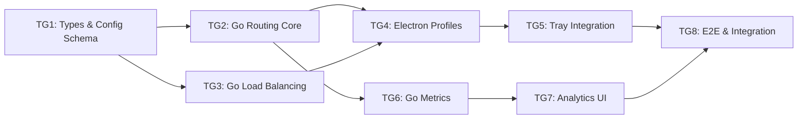

# Tasks: Phase C - Power Users & Routing Intelligence

> **Spec**: [spec.md](spec.md)
> **Created**: 2025-12-17
> **Status**: Complete (TG1-TG8 Complete)

---

## Task Overview



| Group | Name | Dependencies | Estimate | Status |
|-------|------|--------------|----------|--------|
| TG1 | Types & Config Schema | None | 1.5h | ✅ |
| TG2 | Go Routing Core | TG1 | 3h | ✅ |
| TG3 | Go Load Balancing | TG1 | 3h | ✅ |
| TG4 | Electron Profiles | TG2, TG3 | 4h | ✅ |
| TG5 | Tray Integration | TG4 | 2h | ✅ |
| TG6 | Go Metrics Collection | TG2 | 3h | ✅ |
| TG7 | Analytics UI | TG6 | 3h | ✅ |
| TG8 | E2E & Integration Tests | TG5, TG7 | 2.5h | ✅ |

**Total Estimate**: ~22 hours

---

## Task Group 1: Types & Config Schema

**Dependencies**: None
**Estimated**: 1.5 hours
**Files**: `electron/common/ipc-types.ts`, `CLIProxyAPI/internal/config/routing.go`

### Tests First
- [ ] Test: Profile type validates with required fields (id, name, routingRules)
- [ ] Test: ProviderGroup type validates with accountIds array
- [ ] Test: RoutingConfig JSON schema validates version field
- [ ] Test: RequestType enum has all 4 values (chat, completion, embedding, other)
- [ ] Test: Config file with missing version defaults to v1

### Implementation
- [ ] Add TypeScript types to `electron/common/ipc-types.ts`:
  ```typescript
  type RequestType = 'chat' | 'completion' | 'embedding' | 'other'
  interface Profile { id, name, color, icon, routingRules, defaultProviderGroup, createdAt, updatedAt }
  interface ProviderGroup { id, name, accountIds, selectionStrategy }
  interface RoutingConfig { version, activeProfileId, profiles, providerGroups, modelFamilies }
  ```
- [ ] Add Zod schemas to `electron/common/ipc-schemas.ts`
- [ ] Create Go types in `CLIProxyAPI/internal/config/routing.go`:
  - `RequestType` enum
  - `Profile` struct
  - `ProviderGroup` struct
  - `RoutingConfig` struct
- [ ] Add JSON tags and validation to Go structs
- [ ] Create config file path helper: `~/.korproxy/config.json`

### Verification
- [ ] Run TypeScript: `cd korproxy-app && bun run typecheck`
- [ ] Run Go: `cd CLIProxyAPI && go build ./...`

### Acceptance Criteria
- All types compile in both TypeScript and Go
- Zod schemas validate test fixtures
- Config path works on macOS, Windows, Linux

---

## Task Group 2: Go Routing Core

**Dependencies**: TG1
**Estimated**: 3 hours
**Files**: `CLIProxyAPI/internal/routing/classifier.go`, `CLIProxyAPI/internal/routing/config.go`

### Tests First
- [ ] Test: `/v1/chat/completions` classified as `chat`
- [ ] Test: `/v1/completions` classified as `completion`
- [ ] Test: `/v1/embeddings` classified as `embedding`
- [ ] Test: Unknown path classified as `other`
- [ ] Test: Model `gpt-4o` matches `chat` family pattern `gpt-4*`
- [ ] Test: Config file watcher detects changes within 1s
- [ ] Test: Invalid config JSON logs error, uses defaults

### Implementation
- [ ] Create `internal/routing/classifier.go`:
  - `ClassifyRequest(path, model string) RequestType`
  - Path-based classification (primary)
  - Model family matching (secondary)
- [ ] Create `internal/routing/config.go`:
  - `LoadConfig(path string) (*RoutingConfig, error)`
  - `WatchConfig(path string, onChange func(*RoutingConfig))`
  - File watcher using `fsnotify`
- [ ] Create `internal/routing/router.go`:
  - `ResolveProviderGroup(config *RoutingConfig, requestType RequestType) *ProviderGroup`
  - Active profile lookup
  - Routing rule resolution
- [ ] Integrate with request pipeline in `internal/api/server.go`
- [ ] Add `RequestContext` to carry classification through pipeline

### Verification
- [ ] Run tests: `cd CLIProxyAPI && go test ./internal/routing/...`
- [ ] Manual: Create config file, verify hot-reload works

### Acceptance Criteria
- All request types correctly classified
- Config changes apply without restart
- Routing decision < 5ms (benchmark test)

---

## Task Group 3: Go Load Balancing

**Dependencies**: TG1
**Estimated**: 3 hours
**Files**: `CLIProxyAPI/sdk/cliproxy/auth/group_selector.go`, `CLIProxyAPI/sdk/cliproxy/auth/health.go`

### Tests First
- [ ] Test: Round-robin cycles through 3 accounts in order
- [ ] Test: Account marked `rate_limited` on 429 response
- [ ] Test: Rate-limited account skipped in selection
- [ ] Test: Account returns to `available` after backoff expires
- [ ] Test: All accounts rate-limited returns least-recently-limited
- [ ] Test: 3+ consecutive failures marks account as `erroring`
- [ ] Test: Erroring account recovers after 30min timeout

### Implementation
- [ ] Create `sdk/cliproxy/auth/health.go`:
  - `HealthStatus` enum: `available`, `rate_limited`, `erroring`
  - `AccountHealth` struct with status, lastError, backoffUntil
  - `HealthTracker` with thread-safe status updates
- [ ] Create `sdk/cliproxy/auth/group_selector.go`:
  - Extend `RoundRobinSelector` pattern
  - `PickFromGroup(group *ProviderGroup, model string) (*Auth, error)`
  - Filter by health status before selection
  - Integrate with existing `Auth` and `ModelStates`
- [ ] Add backoff calculation:
  - Initial: 30s
  - Exponential: 30s, 60s, 120s, max 5min
- [ ] Hook into response handling to update health on 429/5xx
- [ ] Add manual health reset endpoint: `POST /_korproxy/health/reset`

### Verification
- [ ] Run tests: `cd CLIProxyAPI && go test ./sdk/cliproxy/auth/...`
- [ ] Manual: Simulate 429, verify account rotation

### Acceptance Criteria
- Healthy accounts selected via round-robin
- Rate-limited accounts automatically skipped
- Backoff and recovery works correctly

---

## Task Group 4: Electron Profiles

**Dependencies**: TG2, TG3
**Estimated**: 4 hours
**Files**: `src/stores/profileStore.ts`, `src/pages/Settings.tsx`, `electron/main/config-writer.ts`

### Tests First
- [ ] Test: `profileStore` initializes with "Default" profile
- [ ] Test: Create profile adds to store and persists
- [ ] Test: Delete profile removes from store (except Default)
- [ ] Test: Set active profile updates `activeProfileId`
- [ ] Test: Config sync writes valid JSON to `~/.korproxy/config.json`
- [ ] Test: Profile with duplicate name rejected

### Implementation
- [ ] Create `src/stores/profileStore.ts`:
  ```typescript
  // Zustand store with persist middleware
  // State: profiles[], providerGroups[], activeProfileId
  // Actions: createProfile, updateProfile, deleteProfile, setActive, syncConfig
  ```
- [ ] Create `electron/main/config-writer.ts`:
  - Write config to `~/.korproxy/config.json`
  - Ensure directory exists
  - Atomic write (write to temp, rename)
- [ ] Add IPC handlers in `electron/main/ipc.ts`:
  - `PROFILE_LIST`, `PROFILE_CREATE`, `PROFILE_UPDATE`, `PROFILE_DELETE`
  - `PROFILE_SET_ACTIVE`, `CONFIG_SYNC`
- [ ] Add "Profiles" tab to Settings page:
  - Profile list with color badges
  - Create/Edit profile modal
  - Delete confirmation
  - Active profile indicator
- [ ] Add "Provider Groups" section:
  - List groups with account counts
  - Create/Edit group modal
  - Assign accounts to groups

### Verification
- [ ] Run tests: `cd korproxy-app && bun run test -- --grep "profile"`
- [ ] Manual: Create profile, verify config file written

### Acceptance Criteria
- Profiles persist across app restart
- Config file synced on every change
- Default profile cannot be deleted

---

## Task Group 5: Tray Integration

**Dependencies**: TG4
**Estimated**: 2 hours
**Files**: `electron/main/tray.ts`

### Tests First
- [ ] Test: Tray menu includes "Profiles" submenu
- [ ] Test: Submenu lists all profiles with radio selection
- [ ] Test: Clicking profile updates `activeProfileId`
- [ ] Test: Tray tooltip shows current profile name
- [ ] Test: Profile list updates when profiles change

### Implementation
- [ ] Extend `buildContextMenu()` in `electron/main/tray.ts`:
  ```typescript
  {
    label: 'Profiles',
    submenu: profiles.map(p => ({
      label: p.name,
      type: 'radio',
      checked: p.id === activeProfileId,
      click: () => setActiveProfile(p.id)
    }))
  }
  ```
- [ ] Add profile change listener to rebuild menu
- [ ] Update tooltip format: `KorProxy - [Profile] - Running/Stopped`
- [ ] Add IPC call to sync config after profile switch
- [ ] Handle case where profile store not yet loaded

### Verification
- [ ] Run tests: `cd korproxy-app && bun run test -- --grep "tray"`
- [ ] Manual: Switch profile via tray, verify immediate effect

### Acceptance Criteria
- Profile switching works from tray
- Menu updates when profiles added/removed
- Tooltip reflects current profile

---

## Task Group 6: Go Metrics Collection

**Dependencies**: TG2
**Estimated**: 3 hours
**Files**: `CLIProxyAPI/internal/metrics/collector.go`, `CLIProxyAPI/internal/metrics/store.go`

### Tests First
- [ ] Test: Request increments count for provider/model/type
- [ ] Test: Latency recorded in histogram buckets
- [ ] Test: Failure increments error count by type (429, 5xx, timeout)
- [ ] Test: Metrics aggregated by day
- [ ] Test: Old metrics pruned after retention period
- [ ] Test: Metrics endpoint returns valid JSON

### Implementation
- [ ] Create `internal/metrics/collector.go`:
  - `RecordRequest(provider, model, profile, requestType, latencyMs, errorType)`
  - Thread-safe counters and histograms
  - Batch writes to storage
- [ ] Create `internal/metrics/store.go`:
  - JSON file per day: `~/.korproxy/metrics/YYYY-MM-DD.json`
  - `LoadMetrics(from, to time.Time) (*MetricsResponse, error)`
  - `PruneOldMetrics(retentionDays int)`
- [ ] Create `internal/metrics/histogram.go`:
  - Simple bucket-based histogram for percentiles
  - Buckets: [0, 50, 100, 200, 500, 1000, 2000, 5000]ms
- [ ] Register metrics endpoint: `GET /_korproxy/metrics`
  - Query params: `from`, `to`, `granularity`
  - Response matches spec schema
- [ ] Hook collector into request/response pipeline

### Verification
- [ ] Run tests: `cd CLIProxyAPI && go test ./internal/metrics/...`
- [ ] Manual: Make requests, query metrics endpoint

### Acceptance Criteria
- Metrics collected without impacting latency (< 1ms overhead)
- Metrics endpoint returns accurate aggregates
- Old data automatically pruned

---

## Task Group 7: Analytics UI

**Dependencies**: TG6
**Estimated**: 3 hours
**Files**: `src/pages/Analytics.tsx`, `src/components/analytics/*.tsx`

### Tests First
- [ ] Test: Analytics page fetches from `/_korproxy/metrics`
- [ ] Test: Summary cards show total requests, failures, avg latency
- [ ] Test: Provider chart renders bar chart with correct data
- [ ] Test: Date range picker updates query params
- [ ] Test: Empty state shown when no metrics

### Implementation
- [ ] Create `src/pages/Analytics.tsx`:
  - Date range picker (last 7d, 30d, custom)
  - Summary cards row
  - Charts grid
- [ ] Create `src/components/analytics/SummaryCards.tsx`:
  - Total Requests, Total Failures, Avg Latency, Success Rate
- [ ] Create `src/components/analytics/ProviderChart.tsx`:
  - Bar chart by provider (use recharts or similar)
- [ ] Create `src/components/analytics/RequestTypeChart.tsx`:
  - Pie/donut chart by request type
- [ ] Create `src/components/analytics/DailyChart.tsx`:
  - Line chart of daily requests over time
- [ ] Add `src/hooks/useMetrics.ts`:
  - Fetch from `http://localhost:1337/_korproxy/metrics`
  - React Query for caching/refetch
- [ ] Add "Analytics" tab to Settings or sidebar navigation
- [ ] Add "Clear Data" button with confirmation

### Verification
- [ ] Run tests: `cd korproxy-app && bun run test -- --grep "analytics"`
- [ ] Manual: View analytics with real data

### Acceptance Criteria
- Charts render correctly with data
- Date range filtering works
- Page loads in < 500ms

---

## Task Group 8: E2E & Integration Tests

**Dependencies**: TG5, TG7
**Estimated**: 2.5 hours
**Files**: `korproxy-app/e2e/*.spec.ts`

### Tests First (E2E)
- [ ] E2E: Create profile → configure routing → request routes correctly
- [ ] E2E: Switch profile via tray → next request uses new profile
- [ ] E2E: Account returns 429 → automatic failover to next account
- [ ] E2E: Open Analytics → charts render with data
- [ ] E2E: Delete profile → tray menu updates immediately

### Implementation
- [ ] Write Playwright E2E tests:
  - Full profile CRUD flow
  - Tray profile switching
  - Routing verification (mock AI responses)
  - Analytics page rendering
- [ ] Write integration tests:
  - Config file sync between Electron and Go
  - Health state propagation
  - Metrics collection accuracy
- [ ] Add visual regression tests:
  - Screenshot Profiles tab
  - Screenshot Analytics page
  - Screenshot tray menu with profiles
- [ ] Performance tests:
  - Routing decision latency < 5ms
  - Profile switch < 1s effective
  - Analytics page load < 500ms

### Verification
- [ ] Run E2E: `cd korproxy-app && bun run test:e2e`
- [ ] Run full suite: `bun run test && bun run typecheck && bun run lint`

### Acceptance Criteria
- All E2E tests pass
- No visual regressions
- Performance targets met

---

## Final Checklist

- [ ] All task groups complete
- [ ] All tests passing: `bun run test && bun run test:e2e`
- [ ] Go builds: `cd CLIProxyAPI && go build ./...`
- [ ] TypeScript compiles: `bun run typecheck`
- [ ] Lint passes: `bun run lint`
- [ ] Code reviewed
- [ ] Documentation updated
- [ ] Ready for verification phase

---

## Notes

### Parallelization Opportunities
- TG2 (Routing) and TG3 (Load Balancing) can run in parallel after TG1
- TG6 (Metrics) can start once TG2 is done, parallel to TG4/TG5
- TG7 (Analytics UI) can start once TG6 metrics endpoint is working

### Decisions
- **Config file location**: `~/.korproxy/config.json` (cross-platform via Go `os.UserConfigDir`)
- **Metrics storage**: JSON per day in `~/.korproxy/metrics/`
- **Chart library**: Use recharts (already in project) or lightweight alternative
- **Tray submenu**: Radio buttons for profile selection

### Dependencies on Phase B
- Onboarding store pattern for profile store
- Settings page tabs structure
- IPC handler patterns with Zod

### Risk Mitigations
- **Go submodule changes**: Create separate PR for CLIProxyAPI, version bump
- **Config file conflicts**: Atomic writes, file locking
- **Performance**: Benchmark routing/metrics early, optimize if needed
