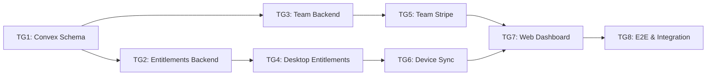

# Tasks: Phase D - Teams, Billing & Web Dashboard

> **Spec**: [spec.md](spec.md)
> **Created**: 2025-12-17
> **Status**: Completed

---

## Task Overview



| Group | Name | Dependencies | Estimate | Status |
|-------|------|--------------|----------|--------|
| TG1 | Convex Schema & Types | None | 2h | ✅ |
| TG2 | Entitlements Backend | TG1 | 3h | ✅ |
| TG3 | Team Backend (CRUD + Invites) | TG1 | 4h | ✅ |
| TG4 | Desktop Entitlements Store | TG2 | 4h | ✅ |
| TG5 | Team Stripe Integration | TG3 | 3h | ✅ |
| TG6 | Device Sync | TG4 | 3h | ✅ |
| TG7 | Web Dashboard Pages | TG5, TG6 | 6h | ✅ |
| TG8 | E2E & Integration Tests | TG7 | 3h | ✅ |

**Total Estimate**: ~28 hours (~6 weeks at part-time)

---

## Task Group 1: Convex Schema & Types

**Dependencies**: None
**Estimated**: 2 hours
**Files**: `korproxy-backend/convex/schema.ts`, `korproxy-app/src/types/entitlements.ts`

### Tests First
- [ ] Test: `teams` table schema validates with all required fields
- [ ] Test: `teamMembers` table validates role enum (owner, admin, member)
- [ ] Test: `teamInvites` table validates status enum and token field
- [ ] Test: `devices` table validates platform enum (darwin, win32, linux)
- [ ] Test: Entitlements type computes correct limits for each plan

### Implementation
- [ ] Add `teams` table to `korproxy-backend/convex/schema.ts`:
  - Fields: name, ownerUserId, stripeCustomerId, subscriptionStatus, seatsPurchased, seatsUsed
  - Indexes: `by_owner`, `by_stripe_customer`
- [ ] Add `teamMembers` table:
  - Fields: teamId, userId, role, status, joinedAt, removedAt
  - Indexes: `by_team`, `by_user`, `by_team_user`
- [ ] Add `teamInvites` table:
  - Fields: teamId, invitedEmail, inviterUserId, role, status, token, expiresAt
  - Indexes: `by_team`, `by_token`, `by_email`
- [ ] Add `devices` table:
  - Fields: userId, deviceId, deviceName, deviceType, platform, appVersion, lastSeenAt
  - Indexes: `by_user`, `by_device_id`
- [ ] Create `korproxy-app/src/types/entitlements.ts`:
  - `Entitlements` interface with plan, scope, limits, status
  - `PlanLimits` const with Free/Pro/Team limits
- [ ] Add Zod schemas for IPC validation

### Verification
- [ ] Run Convex dev: `cd korproxy-backend && npx convex dev`
- [ ] Run typecheck: `cd korproxy-app && bun run typecheck`

### Acceptance Criteria
- All 4 new tables created in Convex
- Schema deployed without errors
- TypeScript types compile

---

## Task Group 2: Entitlements Backend

**Dependencies**: TG1
**Estimated**: 3 hours
**Files**: `korproxy-backend/convex/entitlements.ts`

### Tests First
- [ ] Test: `entitlements.get` returns Free plan for user with no subscription
- [ ] Test: `entitlements.get` returns Pro plan for user with active subscription
- [ ] Test: `entitlements.get` returns Team plan for user in active team
- [ ] Test: Personal Pro subscription beats team member status
- [ ] Test: Grace period calculated correctly for past_due status
- [ ] Test: Entitlements include correct feature limits per plan

### Implementation
- [ ] Create `korproxy-backend/convex/entitlements.ts`:
  ```typescript
  // Query: get(userId) -> Entitlements
  // - Fetch user subscription status
  // - Fetch team memberships
  // - Compute highest plan level
  // - Apply limits based on tier
  // - Calculate grace period if needed
  ```
- [ ] Add `getForTeam(teamId)` query for team-specific entitlements
- [ ] Add helper functions:
  - `computePlanLimits(plan: Plan): PlanLimits`
  - `calculateGracePeriod(status, periodEnd): Date | null`
  - `resolveHighestPlan(userPlan, teamMemberships): Plan`
- [ ] Ensure all queries have `returns` validator

### Verification
- [ ] Run tests: `cd korproxy-backend && npx convex dev` (check console)
- [ ] Manual: Query entitlements via Convex dashboard

### Acceptance Criteria
- Entitlements query returns correct data for all plan types
- Grace period logic works correctly
- Query performance < 100ms

---

## Task Group 3: Team Backend (CRUD + Invites)

**Dependencies**: TG1
**Estimated**: 4 hours
**Files**: `korproxy-backend/convex/teams.ts`, `korproxy-backend/convex/invites.ts`

### Tests First
- [ ] Test: `teams.create` sets caller as owner
- [ ] Test: `teams.delete` fails if members still exist
- [ ] Test: `teams.transferOwnership` changes owner role
- [ ] Test: `invites.create` fails if seats exhausted
- [ ] Test: `invites.accept` increments seatsUsed
- [ ] Test: `invites.accept` fails for expired token
- [ ] Test: `members.remove` decrements seatsUsed
- [ ] Test: Only owner can delete team

### Implementation
- [ ] Create `korproxy-backend/convex/teams.ts`:
  - `create(name)` - Create team, add caller as owner member
  - `get(teamId)` - Get team with member count
  - `listForUser(userId)` - List user's teams
  - `update(teamId, updates)` - Update team name (owner/admin only)
  - `delete(teamId)` - Delete team (owner only, no members)
  - `transferOwnership(teamId, newOwnerId)` - Change owner
  - `listMembers(teamId)` - Get all members with user info
- [ ] Create `korproxy-backend/convex/invites.ts`:
  - `create(teamId, email, role)` - Create invite (check seats)
  - `accept(token)` - Join team (validate token, increment seats)
  - `revoke(inviteId)` - Cancel pending invite
  - `resend(inviteId)` - Reset expiry, regenerate token
  - `listForTeam(teamId)` - Get pending invites
- [ ] Create `korproxy-backend/convex/members.ts`:
  - `updateRole(memberId, role)` - Change member role (owner/admin only)
  - `remove(memberId)` - Remove from team (decrement seats)
- [ ] Add RBAC helper: `checkTeamPermission(ctx, teamId, requiredRole)`
- [ ] Generate secure invite tokens using crypto

### Verification
- [ ] Run Convex dev and test via dashboard
- [ ] Manual: Create team, invite, accept flow

### Acceptance Criteria
- Full team CRUD works
- Invite flow with token validation works
- Seat counting is accurate
- RBAC prevents unauthorized actions

---

## Task Group 4: Desktop Entitlements Store

**Dependencies**: TG2
**Estimated**: 4 hours
**Files**: `korproxy-app/src/stores/entitlementStore.ts`, `korproxy-app/src/components/UpgradeModal.tsx`

### Tests First
- [ ] Test: `entitlementStore` initializes with cached entitlements
- [ ] Test: Store syncs entitlements from Convex on login
- [ ] Test: Offline grace period uses cached entitlements for 72h
- [ ] Test: After 72h offline, falls back to Free tier
- [ ] Test: `hasFeature('smartRouting')` returns correct value per plan
- [ ] Test: Upgrade CTA shown when hitting profile limit

### Implementation
- [ ] Create `korproxy-app/src/stores/entitlementStore.ts`:
  ```typescript
  // Zustand store with persist middleware
  // State: entitlements, lastSynced, offlineGraceUntil
  // Actions: syncFromServer, checkFeature, openUpgrade
  ```
- [ ] Add IPC handlers in `electron/main/ipc.ts`:
  - `ENTITLEMENTS_GET` - Return cached entitlements
  - `ENTITLEMENTS_SYNC` - Fetch from Convex, update cache
- [ ] Create `src/components/billing/UpgradeModal.tsx`:
  - Show plan comparison
  - "Upgrade to Pro" and "Upgrade to Team" buttons
  - Opens Stripe Checkout in browser
- [ ] Create `src/components/billing/UpgradeBanner.tsx`:
  - Inline banner for limit warnings
  - "Past due" warning banner
- [ ] Add `useEntitlements()` hook for components
- [ ] Integrate entitlement checks into:
  - Profile creation (check maxProfiles)
  - Provider group creation (check maxProviderGroups)
  - Analytics page (check retention days)

### Verification
- [ ] Run tests: `cd korproxy-app && bun run test -- --grep "entitlement"`
- [ ] Manual: Create profiles until limit, verify upgrade prompt

### Acceptance Criteria
- Entitlements cached and synced correctly
- Offline grace period works
- Upgrade CTAs appear at correct times
- Feature checks work throughout app

---

## Task Group 5: Team Stripe Integration

**Dependencies**: TG3
**Estimated**: 3 hours
**Files**: `korproxy-backend/convex/stripe.ts` (extend)

### Tests First
- [ ] Test: `createTeamCheckoutSession` creates session with seat quantity
- [ ] Test: Webhook `customer.subscription.updated` updates team seatsPurchased
- [ ] Test: Webhook updates team subscriptionStatus correctly
- [ ] Test: `updateTeamSeats` modifies Stripe subscription quantity
- [ ] Test: Idempotent webhook processing (same event twice)

### Implementation
- [ ] Extend `korproxy-backend/convex/stripe.ts`:
  - `createTeamCheckoutSession(teamId, seats)` action:
    - Get or create Stripe customer for team
    - Create checkout session with quantity
    - Include team metadata
  - `updateTeamSeats(teamId, newSeatCount)` action:
    - Update Stripe subscription quantity
    - Webhook will update team.seatsPurchased
- [ ] Extend webhook handler for team subscriptions:
  - Check metadata for `teamId`
  - Update teams table instead of users
  - Extract `quantity` → `seatsPurchased`
- [ ] Add `STRIPE_TEAM_PRICE_ID` environment variable
- [ ] Create Stripe Product/Price for Team plan in dashboard

### Verification
- [ ] Run Stripe CLI: `stripe listen --forward-to localhost:3000/api/webhooks/stripe`
- [ ] Manual: Complete team checkout, verify webhook updates team

### Acceptance Criteria
- Team checkout creates subscription with seats
- Webhooks update team subscription status
- Seat quantity syncs correctly
- Idempotent processing works

---

## Task Group 6: Device Sync

**Dependencies**: TG4
**Estimated**: 3 hours
**Files**: `korproxy-backend/convex/devices.ts`, `korproxy-app/electron/main/device.ts`

### Tests First
- [ ] Test: Device registered on app startup
- [ ] Test: Device ID persists across app restarts
- [ ] Test: `lastSeenAt` updated on each sync
- [ ] Test: Duplicate device ID updates existing record
- [ ] Test: Remote sign-out removes device
- [ ] Test: Settings changes sync to other devices within 5s

### Implementation
- [ ] Create `korproxy-backend/convex/devices.ts`:
  - `register(deviceInfo)` mutation - Upsert device record
  - `listForUser(userId)` query - Get user's devices
  - `remove(deviceId)` mutation - Sign out device
  - `updateLastSeen(deviceId)` mutation - Heartbeat
- [ ] Create `korproxy-app/electron/main/device.ts`:
  - Generate persistent device ID (store in `~/.korproxy/device-id`)
  - Get device name from OS (`os.hostname()`)
  - Get platform (`process.platform`)
- [ ] Add IPC handlers:
  - `DEVICE_REGISTER` - Register on startup
  - `DEVICE_GET_INFO` - Return device metadata
- [ ] Integrate with app startup:
  - Call device registration after auth
  - Update `lastSeenAt` periodically (every 5 min)
- [ ] Add real-time sync for entitlements:
  - Use Convex `useQuery` subscription
  - Update local store on changes

### Verification
- [ ] Run tests: `cd korproxy-app && bun run test -- --grep "device"`
- [ ] Manual: Login on two devices, verify sync

### Acceptance Criteria
- Device registered automatically
- Device ID persists
- Remote sign-out works
- Settings sync in real-time

---

## Task Group 7: Web Dashboard Pages

**Dependencies**: TG5, TG6
**Estimated**: 6 hours
**Files**: `korproxy-web/src/app/dashboard/*`

### Tests First
- [ ] Test: Overview page shows current plan status
- [ ] Test: Billing page opens Stripe Portal
- [ ] Test: Teams page lists user's teams
- [ ] Test: Team detail page shows members
- [ ] Test: Invite acceptance page joins team
- [ ] Test: Account page shows devices
- [ ] Test: Protected routes redirect unauthenticated users

### Implementation
- [ ] Create `korproxy-web/src/app/dashboard/page.tsx` (Overview):
  - Plan status card
  - Usage summary (from Phase C analytics)
  - Alerts (past due, trial ending)
  - Quick actions (upgrade, manage billing)
- [ ] Create `korproxy-web/src/app/dashboard/billing/page.tsx`:
  - Current plan details
  - "Manage Billing" button → Stripe Portal
  - "Upgrade" button → Stripe Checkout
  - Invoice history (if available)
- [ ] Create `korproxy-web/src/app/dashboard/teams/page.tsx`:
  - List of user's teams with role
  - "Create Team" button
  - Team cards with member count
- [ ] Create `korproxy-web/src/app/dashboard/teams/[id]/page.tsx`:
  - Team details header
  - Members tab with role badges
  - Invites tab with pending invites
  - Settings tab (name, delete)
  - "Invite Member" modal
- [ ] Create `korproxy-web/src/app/dashboard/account/page.tsx`:
  - Profile information
  - Devices list with "Sign Out" button
  - Preferences
- [ ] Create `korproxy-web/src/app/invite/[token]/page.tsx`:
  - Show invite details
  - "Accept Invite" button
  - Handle expired/invalid tokens
- [ ] Add navigation to dashboard layout sidebar

### Verification
- [ ] Run dev: `cd korproxy-web && bun run dev`
- [ ] Manual: Navigate all pages, verify data loads

### Acceptance Criteria
- All dashboard pages render correctly
- Data fetches from Convex
- Actions work (invite, manage billing, etc.)
- Protected routes enforce auth
- Page load < 2 seconds

---

## Task Group 8: E2E & Integration Tests

**Dependencies**: TG7
**Estimated**: 3 hours
**Files**: `korproxy-app/e2e/*.spec.ts`, `korproxy-web/e2e/*.spec.ts`

### Tests First (E2E)
- [ ] E2E: Free user upgrades to Pro → features unlock
- [ ] E2E: Create team → invite member → member accepts
- [ ] E2E: Payment fails → graceful degradation with banner
- [ ] E2E: Web dashboard → navigate all pages
- [ ] E2E: Multi-device sync → change on A, see on B
- [ ] E2E: Webhook replay → no duplicate state changes

### Implementation
- [ ] Write Playwright E2E tests for desktop app:
  - Subscription checkout flow (mock Stripe)
  - Entitlement enforcement (profile limits)
  - Offline grace period behavior
  - Upgrade CTA interactions
- [ ] Write Playwright E2E tests for web dashboard:
  - Full dashboard navigation
  - Team CRUD flow
  - Invite acceptance flow
  - Billing management
- [ ] Write integration tests:
  - Convex ↔ Stripe webhook flow
  - Desktop ↔ Convex entitlement sync
  - Multi-device sync timing
- [ ] Add edge case tests:
  - Expired invite token
  - Seats exhausted
  - Owner tries to leave
  - 72h offline fallback
- [ ] Performance tests:
  - Entitlement check < 10ms
  - Dashboard load < 2s
  - Webhook processing < 500ms

### Verification
- [ ] Run E2E (app): `cd korproxy-app && bun run test:e2e`
- [ ] Run E2E (web): `cd korproxy-web && bun run test:e2e`
- [ ] Run full suite: `bun run test && bun run typecheck && bun run lint`

### Acceptance Criteria
- All E2E tests pass
- Integration tests pass
- Performance targets met
- No regressions from Phase C

---

## Final Checklist

- [ ] All task groups complete
- [ ] All tests passing:
  - `cd korproxy-app && bun run test && bun run test:e2e`
  - `cd korproxy-web && bun run test:e2e`
  - `cd korproxy-backend && npx convex dev` (no errors)
- [ ] TypeScript compiles: `bun run typecheck`
- [ ] Lint passes: `bun run lint`
- [ ] Stripe Products/Prices created:
  - Pro Monthly
  - Pro Yearly
  - Team (per-seat)
- [ ] Environment variables set:
  - `STRIPE_TEAM_PRICE_ID`
- [ ] Code reviewed
- [ ] Documentation updated
- [ ] Ready for verification phase

---

## Notes

### Parallelization Opportunities
- TG2 (Entitlements Backend) and TG3 (Team Backend) can run in parallel after TG1
- TG4 (Desktop Entitlements) can start once TG2 entitlements query is working
- TG6 (Device Sync) can run parallel to TG5 (Team Stripe)

### Phase Alignment
| Task Group | Phase | Week |
|------------|-------|------|
| TG1, TG2, TG4 | D1: Subscription Enforcement | 1-2 |
| TG3, TG5 | D2: Team Infrastructure | 3-4 |
| TG6, TG7, TG8 | D3: Multi-Device & Dashboard | 5-6 |

### Risk Mitigations
- **Stripe setup**: Create Products/Prices early, test with Stripe CLI
- **Convex schema**: Deploy schema changes before dependent code
- **Multi-device sync**: Test with real devices, not just browser tabs
- **Webhook reliability**: Implement idempotency from the start

### External Dependencies
- Stripe Dashboard: Create Team plan Product/Price
- Stripe CLI: For local webhook testing
- Vercel: Deploy web dashboard updates

### Decisions
- **Email for invites**: Use Convex action (defer external email service)
- **Device ID storage**: `~/.korproxy/device-id` file
- **Free tier limits**: 1 profile, 2 provider groups (per spec)
- **Grace period**: 3 days past_due, 72h offline
