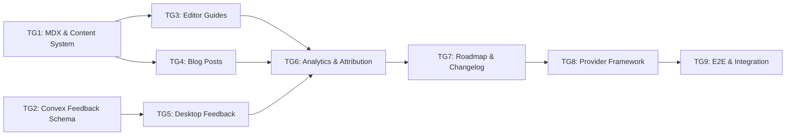

# Tasks: Phase E - Ecosystem & Growth

> **Spec**: [spec.md](spec.md)
> **Created**: 2025-12-17
> **Status**: Complete

---

## Task Overview



| Group | Name | Dependencies | Estimate | Status |
|-------|------|--------------|----------|--------|
| TG1 | MDX & Content System | None | 3h | ⬜ |
| TG2 | Convex Feedback Schema | None | 2h | ⬜ |
| TG3 | Editor Guides (JetBrains, NeoVim, Emacs) | TG1 | 6h | ⬜ |
| TG4 | Blog Posts (Cornerstone Content) | TG1 | 4h | ⬜ |
| TG5 | Desktop Feedback System | TG2 | 4h | ⬜ |
| TG6 | Analytics & Attribution | TG3, TG4, TG5 | 4h | ⬜ |
| TG7 | Roadmap & Changelog Pages | TG6 | 3h | ⬜ |
| TG8 | Provider Expansion Framework | TG7 | 3h | ⬜ |
| TG9 | E2E & Integration Tests | TG8 | 3h | ⬜ |

**Total Estimate**: ~32 hours (~6 weeks at part-time)

---

## Task Group 1: MDX & Content System

**Dependencies**: None
**Estimated**: 3 hours
**Files**: `korproxy-web/package.json`, `korproxy-web/next.config.ts`, `korproxy-web/content/`

### Tests First
- [ ] Test: MDX files in `content/blog/` render at `/blog/[slug]`
- [ ] Test: Frontmatter (title, date, description) parsed correctly
- [ ] Test: Code blocks render with syntax highlighting
- [ ] Test: Blog listing page shows all posts sorted by date
- [ ] Test: Invalid MDX frontmatter gracefully handled

### Implementation
- [ ] Install MDX dependencies:
  ```bash
  cd korproxy-web && bun add @next/mdx @mdx-js/react gray-matter reading-time
  bun add -D @types/mdx
  ```
- [ ] Update `next.config.ts` with MDX support
- [ ] Create content directory structure:
  ```
  korproxy-web/content/
  ├── blog/
  │   └── .gitkeep
  └── changelog/
      └── .gitkeep
  ```
- [ ] Create `src/lib/content.ts`:
  - `getAllPosts()` - Read all MDX files, parse frontmatter
  - `getPostBySlug(slug)` - Get single post with content
  - `getChangelog()` - Read changelog entries
- [ ] Create `src/app/blog/page.tsx` - Blog listing page
- [ ] Create `src/app/blog/[slug]/page.tsx` - Blog post page
- [ ] Add MDX components wrapper for consistent styling

### Verification
- [ ] Run dev: `cd korproxy-web && bun run dev`
- [ ] Create test MDX file, verify it renders at `/blog/test`
- [ ] Run typecheck: `bun run typecheck`

### Acceptance Criteria
- MDX files render as pages
- Frontmatter parsed for metadata
- Code blocks have syntax highlighting
- Blog listing shows all posts

---

## Task Group 2: Convex Feedback Schema

**Dependencies**: None
**Estimated**: 2 hours
**Files**: `korproxy-backend/convex/schema.ts`, `korproxy-backend/convex/feedback.ts`

### Tests First
- [ ] Test: `feedback` table validates category enum (bug, feature, general)
- [ ] Test: `feedback` table validates status enum (new, reviewed, resolved, closed)
- [ ] Test: `feedback.submit` creates entry with all required fields
- [ ] Test: `feedback.submit` with `userId = null` for anonymous works
- [ ] Test: `feedback.list` returns paginated results
- [ ] Test: `feedback.updateStatus` changes status (admin only)

### Implementation
- [ ] Add `feedback` table to `korproxy-backend/convex/schema.ts`:
  ```typescript
  feedback: defineTable({
    userId: v.optional(v.id("users")),
    category: v.union(v.literal("bug"), v.literal("feature"), v.literal("general")),
    message: v.string(),
    contactEmail: v.optional(v.string()),
    includesDiagnostics: v.boolean(),
    logExcerpt: v.optional(v.array(v.object({
      level: v.string(),
      message: v.string(),
      timestamp: v.number(),
    }))),
    context: v.optional(v.object({
      provider: v.optional(v.string()),
      model: v.optional(v.string()),
      appVersion: v.string(),
      platform: v.string(),
      os: v.string(),
    })),
    status: v.union(v.literal("new"), v.literal("reviewed"), v.literal("resolved"), v.literal("closed")),
    createdAt: v.number(),
  })
    .index("by_status", ["status"])
    .index("by_user", ["userId"])
    .index("by_date", ["createdAt"]),
  ```
- [ ] Extend `users` table with acquisition fields:
  ```typescript
  acquisitionSource: v.optional(v.string()),
  acquisitionUtm: v.optional(v.object({
    source: v.optional(v.string()),
    medium: v.optional(v.string()),
    campaign: v.optional(v.string()),
  })),
  acquisitionDate: v.optional(v.number()),
  ```
- [ ] Create `korproxy-backend/convex/feedback.ts`:
  - `submit({ category, message, contactEmail?, context?, logExcerpt? })` mutation with `returns` validator
  - `list({ status?, limit?, cursor? })` query with `returns` validator
  - `get(feedbackId)` query with `returns` validator
  - `updateStatus(feedbackId, status)` mutation (admin only)
- [ ] Create `korproxy-backend/convex/users.ts` extension:
  - `setAcquisitionSource(userId, source, utm?)` mutation

### Verification
- [ ] Run Convex dev: `cd korproxy-backend && npx convex dev`
- [ ] Test mutations via Convex dashboard

### Acceptance Criteria
- Feedback table created with all fields
- Users table extended with acquisition fields
- All mutations/queries have `returns` validators
- Schema deploys without errors

---

## Task Group 3: Editor Guides (JetBrains, NeoVim, Emacs)

**Dependencies**: TG1
**Estimated**: 6 hours
**Files**: `korproxy-web/src/app/guides/jetbrains/`, `korproxy-web/src/app/guides/neovim/`, `korproxy-web/src/app/guides/emacs/`

### Tests First
- [ ] Test: `/guides/jetbrains` page renders with all sections
- [ ] Test: `/guides/neovim` page renders with plugin configurations
- [ ] Test: `/guides/emacs` page renders with package configurations
- [ ] Test: All guides have proper meta tags for SEO
- [ ] Test: Cross-links between related guides work
- [ ] Test: Code blocks are copy-able

### Implementation
- [ ] Create `korproxy-web/src/app/guides/jetbrains/page.tsx`:
  - Overview: KorProxy with IntelliJ/PyCharm/WebStorm
  - Prerequisites: KorProxy running, JetBrains IDE, Continue plugin
  - Configuration via Continue plugin:
    - Install Continue from marketplace
    - Edit `~/.continue/config.json`
    - Configure OpenAI-compatible provider
  - Alternative: Direct HTTP proxy setup
  - Model selection recommendations
  - Troubleshooting section
- [ ] Create `korproxy-web/src/app/guides/neovim/page.tsx`:
  - Overview: NeoVim AI plugins with KorProxy
  - Prerequisites: KorProxy running, NeoVim 0.8+
  - Plugin configurations:
    - avante.nvim setup
    - ChatGPT.nvim setup
    - copilot.lua alternative setup
  - Environment variables approach
  - Model selection
  - Troubleshooting
- [ ] Create `korproxy-web/src/app/guides/emacs/page.tsx`:
  - Overview: Emacs AI packages with KorProxy
  - Prerequisites: KorProxy running, Emacs 28+
  - Package configurations:
    - gptel setup
    - chatgpt-shell setup
    - org-ai setup
  - use-package examples
  - Troubleshooting
- [ ] Update `korproxy-web/src/app/guides/page.tsx`:
  - Add JetBrains, NeoVim, Emacs to guides array
  - Add appropriate icons
- [ ] Add SEO metadata to all guide pages:
  - `metadata` export with title, description
  - OpenGraph tags
- [ ] Add cross-links:
  - JetBrains ↔ Continue guide
  - VS Code ↔ Continue guide
  - All guides → Models guide
- [ ] Polish VS Code guide with complete examples

### Verification
- [ ] Run dev: `cd korproxy-web && bun run dev`
- [ ] Navigate to each guide, verify all sections render
- [ ] Check meta tags in page source
- [ ] Run lighthouse for SEO score

### Acceptance Criteria
- All 3 new guides complete with all sections
- SEO metadata present on all pages
- Cross-links functional
- Code blocks copy-able
- Guides index updated

---

## Task Group 4: Blog Posts (Cornerstone Content)

**Dependencies**: TG1
**Estimated**: 4 hours
**Files**: `korproxy-web/content/blog/*.mdx`

### Tests First
- [ ] Test: Blog post 1 renders at correct slug
- [ ] Test: Blog post 2 renders at correct slug
- [ ] Test: Blog listing shows both posts
- [ ] Test: Reading time calculated correctly
- [ ] Test: Author and date display correctly

### Implementation
- [ ] Create `content/blog/use-claude-pro-any-editor.mdx`:
  ```markdown
  ---
  title: "Use Your Claude Pro Subscription in Any Editor"
  description: "Learn how to use your existing Claude Pro subscription with Cursor, VS Code, NeoVim, and more using KorProxy."
  date: "2025-12-17"
  author: "KorProxy Team"
  ---
  
  [Content covering:]
  - The problem: paying twice for AI coding
  - How KorProxy solves it
  - Quick setup overview
  - Supported editors
  - Getting started steps
  ```
- [ ] Create `content/blog/korproxy-vs-native-integrations.mdx`:
  ```markdown
  ---
  title: "KorProxy vs Native Integrations: When to Use a Proxy"
  description: "Compare using KorProxy with native AI integrations. Learn when a proxy approach makes sense for your workflow."
  date: "2025-12-17"
  author: "KorProxy Team"
  ---
  
  [Content covering:]
  - Native integrations overview
  - Proxy approach benefits
  - When to use each
  - Cost comparison
  - Flexibility advantages
  ```
- [ ] Create `content/blog/multi-provider-routing.mdx` (P1, can defer):
  ```markdown
  ---
  title: "Setting Up Multi-Provider Routing for AI Code Assistants"
  description: "Advanced guide to routing different AI requests to different providers based on task type."
  date: "2025-12-17"
  author: "KorProxy Team"
  ---
  
  [Content covering:]
  - Routing rules overview
  - Use cases (fast vs capable models)
  - Configuration examples
  - Load balancing setup
  ```
- [ ] Update blog listing page styling
- [ ] Add "Back to Blog" navigation on post pages
- [ ] Add social sharing links (optional P2)

### Verification
- [ ] Run dev, navigate to `/blog`
- [ ] Click through to each post
- [ ] Verify metadata displays correctly

### Acceptance Criteria
- At least 2 cornerstone posts published
- Blog listing functional
- Posts render with proper styling
- Reading time shows

---

## Task Group 5: Desktop Feedback System

**Dependencies**: TG2
**Estimated**: 4 hours
**Files**: `korproxy-app/src/components/feedback/`, `korproxy-app/electron/main/ipc.ts`, `korproxy-app/electron/common/ipc-types.ts`

### Tests First
- [ ] Test: Feedback modal opens from Help menu
- [ ] Test: Category selection works (bug, feature, general)
- [ ] Test: "Include diagnostic info" checkbox controls log attachment
- [ ] Test: Log excerpt limited to 50 entries, 500 chars each
- [ ] Test: Secrets redacted from logs (sk-*, Bearer, api_key patterns)
- [ ] Test: Feedback submits to Convex successfully
- [ ] Test: Confirmation toast shown after submission
- [ ] Test: Anonymous submission works (no userId)

### Implementation
- [ ] Add IPC types to `electron/common/ipc-types.ts`:
  ```typescript
  // Channels
  FEEDBACK_OPEN: 'feedback:open',
  FEEDBACK_SUBMIT: 'feedback:submit',
  LOGS_GET_RECENT: 'logs:get-recent',
  SYSTEM_GET_INFO: 'system:get-info',
  
  // Zod schemas
  FeedbackSubmitSchema = z.object({
    category: z.enum(['bug', 'feature', 'general']),
    message: z.string().max(5000),
    contactEmail: z.string().email().optional(),
    includeDiagnostics: z.boolean(),
  })
  ```
- [ ] Add IPC handlers in `electron/main/ipc.ts`:
  - `LOGS_GET_RECENT`: Get last N logs, filter to error/warn, truncate, redact secrets
  - `SYSTEM_GET_INFO`: Return { provider, model, appVersion, platform, os }
  - `FEEDBACK_SUBMIT`: Collect context if opted in, submit to Convex
- [ ] Create secret redaction utility in `electron/main/utils/redact.ts`:
  ```typescript
  const REDACT_PATTERNS = [
    /sk-[a-zA-Z0-9]{20,}/g,
    /Bearer\s+\S+/gi,
    /api[_-]?key[=:]\s*\S+/gi,
    /[a-zA-Z0-9]{32,}/g, // Generic long tokens
  ]
  ```
- [ ] Create `src/components/feedback/FeedbackModal.tsx`:
  - Radix Dialog-based modal
  - Category radio buttons
  - Message textarea
  - Optional contact email input
  - "Include diagnostic info" checkbox with disclosure text
  - Submit button with loading state
- [ ] Create `src/hooks/useFeedback.ts`:
  - `openFeedback()` - Open modal
  - `submitFeedback(data)` - Submit via IPC
- [ ] Add Help menu item in app menu
- [ ] Add feedback trigger on error boundary fallback

### Verification
- [ ] Run tests: `cd korproxy-app && bun run test -- --grep "feedback"`
- [ ] Manual: Open modal, submit feedback, verify in Convex dashboard

### Acceptance Criteria
- Feedback modal functional
- Diagnostic info opt-in works
- Secrets redacted from logs
- Submission creates Convex entry
- Toast confirmation shown

---

## Task Group 6: Analytics & Attribution

**Dependencies**: TG3, TG4, TG5
**Estimated**: 4 hours
**Files**: `korproxy-web/src/lib/analytics.ts`, `korproxy-web/src/app/layout.tsx`, `korproxy-app/src/pages/Onboarding.tsx`

### Tests First
- [ ] Test: UTM params captured from URL on page load
- [ ] Test: UTM params stored in sessionStorage
- [ ] Test: "How did you hear?" dropdown saves selection
- [ ] Test: Attribution data sent to Convex on signup
- [ ] Test: Analytics script loads on korproxy-web
- [ ] Test: Deep link `korproxy://launch?utm_source=...` parsed correctly

### Implementation
- [ ] Create `korproxy-web/src/lib/analytics.ts`:
  ```typescript
  // UTM capture
  export function captureUtmParams() {
    const params = new URLSearchParams(window.location.search)
    const utm = {
      source: params.get('utm_source'),
      medium: params.get('utm_medium'),
      campaign: params.get('utm_campaign'),
    }
    if (utm.source) {
      sessionStorage.setItem('korproxy_attribution', JSON.stringify(utm))
    }
  }
  
  export function getStoredAttribution() {
    const stored = sessionStorage.getItem('korproxy_attribution')
    return stored ? JSON.parse(stored) : null
  }
  ```
- [ ] Add analytics provider to `korproxy-web/src/app/layout.tsx`:
  - Add Plausible script (or chosen analytics service)
  - Call `captureUtmParams()` on mount
- [ ] Update download buttons to include UTM in deep links:
  - `korproxy://launch?utm_source=guide&utm_campaign=jetbrains`
- [ ] Update `korproxy-app/src/pages/Onboarding.tsx`:
  - Add "How did you hear about KorProxy?" dropdown:
    - Search engine
    - Blog post
    - Setup guide
    - Friend/colleague
    - Social media
    - Other
  - Parse deep link params if present
  - Store selection in local state
- [ ] On signup completion, call `users.setAcquisitionSource`:
  - Pass deep link UTM if present
  - Or pass onboarding question selection
- [ ] Add URL scheme handler for `korproxy://` in Electron:
  - Parse query params
  - Store in app state for onboarding

### Verification
- [ ] Run web dev, add UTM params to URL, verify sessionStorage
- [ ] Run app, trigger deep link, verify params captured
- [ ] Complete onboarding, verify Convex user has acquisition data

### Acceptance Criteria
- UTM params captured on web
- Onboarding question functional
- Attribution stored in Convex
- Analytics service integrated

---

## Task Group 7: Roadmap & Changelog Pages

**Dependencies**: TG6
**Estimated**: 3 hours
**Files**: `korproxy-web/src/app/roadmap/`, `korproxy-web/src/app/changelog/`, `korproxy-web/content/changelog/`

### Tests First
- [ ] Test: `/roadmap` page renders content from `roadmap.md`
- [ ] Test: Phase status indicators display correctly
- [ ] Test: `/changelog` page lists all changelog entries
- [ ] Test: Changelog entries sorted by date descending
- [ ] Test: GitHub links present where applicable

### Implementation
- [ ] Create `korproxy-web/src/lib/roadmap.ts`:
  - `getRoadmapContent()` - Read and parse `amp-os/product/roadmap.md`
  - Extract phases, features, status
- [ ] Create `korproxy-web/src/app/roadmap/page.tsx`:
  - Render roadmap with visual status indicators
  - Phase cards with feature lists
  - Status badges: Planned (gray), In Progress (blue), Done (green)
  - Links to GitHub milestones
  - SEO metadata
- [ ] Create initial changelog entries in `content/changelog/`:
  ```markdown
  ---
  version: "1.3.0"
  date: "2025-12-17"
  ---
  
  ## Phase D: Teams, Billing & Web Dashboard
  
  - Team accounts with seat-based billing
  - Multi-device sync
  - Web dashboard for usage and billing
  ```
- [ ] Create `korproxy-web/src/app/changelog/page.tsx`:
  - List all changelog entries
  - Version headers with dates
  - Expandable/collapsible sections
  - SEO metadata
- [ ] Add roadmap and changelog to main navigation
- [ ] Add footer links

### Verification
- [ ] Run dev, navigate to `/roadmap`
- [ ] Navigate to `/changelog`
- [ ] Verify status indicators render correctly

### Acceptance Criteria
- Roadmap page renders from source file
- Status indicators visible
- Changelog shows version history
- Pages have proper SEO

---

## Task Group 8: Provider Expansion Framework

**Dependencies**: TG7
**Estimated**: 3 hours
**Files**: `korproxy-app/src/lib/providers/`, `korproxy-web/src/app/guides/models/`

### Tests First
- [ ] Test: Provider registry returns all configured providers
- [ ] Test: New provider descriptor validates correctly
- [ ] Test: `/guides/models` page pulls from provider registry
- [ ] Test: Smoketest runs completion call for provider
- [ ] Test: Smoketest runs chat call for provider

### Implementation
- [ ] Create `korproxy-app/src/lib/providers/registry.ts`:
  ```typescript
  interface ProviderDescriptor {
    id: string
    name: string
    icon: string
    authType: 'oauth' | 'apiKey'
    models: ModelDescriptor[]
    endpoints: {
      completion: string
      chat: string
    }
  }
  
  export const PROVIDER_REGISTRY: ProviderDescriptor[] = [
    // Claude, Codex, Gemini, etc.
  ]
  ```
- [ ] Create provider guide template `docs/provider-guide-template.md`:
  - Standard sections for new provider guides
  - Configuration examples
  - Model recommendations
- [ ] Update `/guides/models` page:
  - Import from provider registry (single source of truth)
  - Dynamic model list generation
- [ ] Create `korproxy-app/src/lib/providers/smoketest.ts`:
  ```typescript
  export async function runProviderSmoketest(providerId: string) {
    // 1. Run completion call
    // 2. Run chat call
    // 3. Return success/failure with timing
  }
  ```
- [ ] Add smoketest command to app:
  - Available from Settings > Providers > Test
  - Shows pass/fail for each provider

### Verification
- [ ] Run tests: `cd korproxy-app && bun run test -- --grep "provider"`
- [ ] Manual: Run smoketest for existing providers

### Acceptance Criteria
- Provider registry centralized
- Models page uses registry
- Smoketests functional
- Guide template created

---

## Task Group 9: E2E & Integration Tests

**Dependencies**: TG8
**Estimated**: 3 hours
**Files**: `korproxy-web/e2e/*.spec.ts`, `korproxy-app/e2e/*.spec.ts`

### Tests First (E2E)
- [ ] E2E: Navigate all guide pages, verify content loads
- [ ] E2E: Submit feedback with diagnostics, verify Convex entry
- [ ] E2E: Blog listing → post detail navigation
- [ ] E2E: Roadmap and changelog pages render
- [ ] E2E: UTM capture → onboarding → attribution stored
- [ ] E2E: Provider smoketest passes for configured providers

### Implementation
- [ ] Write Playwright E2E tests for web:
  - Guide navigation (all new guides)
  - Blog system (listing, posts)
  - Roadmap/changelog pages
  - UTM capture and storage
- [ ] Write Playwright E2E tests for desktop:
  - Feedback modal flow
  - Diagnostic info collection
  - Secret redaction verification
  - Onboarding attribution flow
- [ ] Write integration tests:
  - Feedback → Convex storage
  - Attribution → Convex user update
  - Provider registry → models page
- [ ] Add edge case tests:
  - Empty blog directory
  - Invalid MDX frontmatter
  - Missing UTM params (graceful handling)
  - Maximum log excerpt size
- [ ] Performance tests:
  - Guide page LCP < 1.5s
  - Blog page LCP < 2s
  - Feedback submission < 500ms

### Verification
- [ ] Run E2E (web): `cd korproxy-web && bun run test:e2e`
- [ ] Run E2E (app): `cd korproxy-app && bun run test:e2e`
- [ ] Run full suite: `bun run test && bun run typecheck && bun run lint`

### Acceptance Criteria
- All E2E tests pass
- Integration tests pass
- Performance targets met
- No regressions from Phase D

---

## Final Checklist

- [ ] All task groups complete
- [ ] All tests passing:
  - `cd korproxy-app && bun run test && bun run test:e2e`
  - `cd korproxy-web && bun run test:e2e`
  - `cd korproxy-backend && npx convex dev` (no errors)
- [ ] TypeScript compiles: `bun run typecheck`
- [ ] Lint passes: `bun run lint`
- [ ] MDX dependencies installed
- [ ] Analytics service configured
- [ ] Environment variables set (if any)
- [ ] All guides have SEO metadata
- [ ] Blog posts published
- [ ] Code reviewed
- [ ] Documentation updated
- [ ] Ready for verification phase

---

## Notes

### Parallelization Opportunities
- TG1 (MDX System) and TG2 (Convex Feedback) can run in parallel (no dependencies)
- TG3 (Guides) and TG4 (Blog) can run in parallel after TG1
- TG5 (Desktop Feedback) can run parallel to TG3/TG4 after TG2

### Phase Alignment
| Task Group | Phase | Week |
|------------|-------|------|
| TG1, TG2 | E1: Content Foundation | 1 |
| TG3, TG4, TG5 | E1: Content Foundation | 2 |
| TG6 | E2: Analytics & Attribution | 3 |
| TG7, TG8 | E3: Transparency & Polish | 4-5 |
| TG9 | E3: Transparency & Polish | 6 |

### Risk Mitigations
- **MDX setup**: Test with simple file first before complex content
- **Analytics service**: Choose Plausible or similar early, avoid custom solution
- **Deep links**: Test URL scheme registration on all platforms early
- **Secret redaction**: Unit test patterns thoroughly before integration

### External Dependencies
- Analytics service account (Plausible recommended)
- No Stripe dependencies in Phase E
- GitHub for milestone/issue links (optional)

### Decisions
- **Analytics**: External service for pageviews, Convex for attribution only
- **Feedback offline**: Not supported in Phase E
- **Blog comments**: None for MVP
- **Deep link scheme**: `korproxy://launch?utm_source=...`
- **Log excerpt**: 50 entries max, 500 chars each, error/warn only
