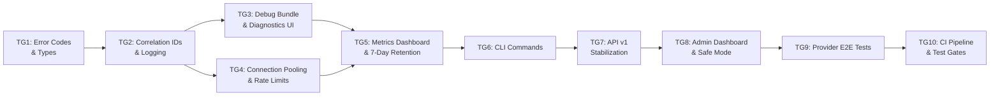

# Tasks: Phase F - GA Readiness & Production Hardening

> **Spec**: [spec.md](spec.md)
> **Created**: 2025-12-17
> **Status**: Complete

---

## Task Overview

| Group | Name | Dependencies | Est. | Status |
|-------|------|--------------|------|--------|
| TG1 | Error Codes & Types | None | 4h | ✅ |
| TG2 | Correlation IDs & Logging | TG1 | 6h | ✅ |
| TG3 | Debug Bundle & Diagnostics UI | TG2 | 8h | ✅ |
| TG4 | Connection Pooling & Rate Limits | TG2 | 6h | ✅ |
| TG5 | Metrics Dashboard & 7-Day Retention | TG3, TG4 | 8h | ✅ |
| TG6 | CLI Commands | TG5 | 6h | ✅ |
| TG7 | API v1 Stabilization | TG6 | 6h | ✅ |
| TG8 | Admin Dashboard & Safe Mode | TG7 | 10h | ✅ |
| TG9 | Provider E2E Tests | TG8 | 12h | ✅ |
| TG10 | CI Pipeline & Test Gates | TG9 | 4h | ✅ |

**Total Estimated**: ~70 hours (8-9 weeks at part-time)

---

## Task Group 1: Error Codes & Types

**Dependencies**: None
**Estimated**: 4 hours
**Spec Refs**: LD6, AC5

### Tests First (6 tests)
- [ ] Test: Error code format validation (KP-XXX-NNN pattern)
- [ ] Test: All error categories have valid codes (AUTH, PROV, CONF, NET, RATE, SYS)
- [ ] Test: Error code to message mapping returns correct messages
- [ ] Test: Error code includes severity level
- [ ] Test: Error serialization to JSON includes all fields
- [ ] Test: HTTP status code mapping for each error category

### Implementation
- [ ] Create `korproxy-app/src/lib/error-codes.ts` with KP-XXX-NNN format
- [ ] Define error categories: AUTH (001-099), PROV (100-199), CONF (200-299), NET (300-399), RATE (400-499), SYS (500-599)
- [ ] Create error code registry with message, description, severity, troubleshooting steps
- [ ] Create `CLIProxyAPI/internal/errors/codes.go` with Go error types
- [ ] Add error code documentation generation script
- [ ] Export error types for IPC communication

### Verification
- [ ] Run tests: `cd korproxy-app && bun run test -- src/lib/error-codes.test.ts`
- [ ] Run tests: `cd CLIProxyAPI && go test ./internal/errors/...`
- [ ] All tests pass

### Acceptance Criteria
- Error codes follow KP-{CATEGORY}-{NUMBER} format
- Each code maps to message, description, troubleshooting steps, severity
- TypeScript and Go implementations share same codes
- Error documentation auto-generated

---

## Task Group 2: Correlation IDs & Logging

**Dependencies**: TG1
**Estimated**: 6 hours
**Spec Refs**: LD1, LD5

### Tests First (6 tests)
- [ ] Test: Correlation ID generated when not provided (UUID v4 format)
- [ ] Test: Correlation ID extracted from X-Correlation-ID header
- [ ] Test: Backward compatibility with X-Request-ID header
- [ ] Test: Correlation ID propagated to provider request headers
- [ ] Test: Response includes both X-Correlation-ID and X-Request-ID
- [ ] Test: Log entries include correlation ID field

### Implementation
- [ ] Update `CLIProxyAPI/internal/api/modules/amp/proxy.go` to generate correlation IDs
- [ ] Create correlation ID middleware in `CLIProxyAPI/internal/api/middleware/correlation.go`
- [ ] Update `CLIProxyAPI/internal/logging/request_logger.go` to include correlation ID
- [ ] Update `korproxy-app/electron/main/log-manager.ts` to accept correlation ID
- [ ] Add correlation ID to IPC request/response types
- [ ] Add configurable log verbosity (debug/info/warn/error) per component

### Verification
- [ ] Run tests: `cd CLIProxyAPI && go test ./internal/api/middleware/...`
- [ ] Run tests: `cd korproxy-app && bun run test -- electron/main/log-manager.test.ts`
- [ ] All tests pass

### Acceptance Criteria
- Correlation IDs propagate: client → proxy → provider → response
- Both X-Correlation-ID and X-Request-ID headers supported
- All log entries include correlation ID
- Log verbosity configurable per component

---

## Task Group 3: Debug Bundle & Diagnostics UI

**Dependencies**: TG2
**Estimated**: 8 hours
**Spec Refs**: LD2, LD3, LD7

### Tests First (8 tests)
- [ ] Test: Debug bundle includes version header
- [ ] Test: Debug bundle includes system info (OS, platform, versions)
- [ ] Test: Config secrets are masked with `***REDACTED***`
- [ ] Test: Log entries are sanitized (API keys, tokens redacted)
- [ ] Test: Bundle includes last 100 log entries
- [ ] Test: Bundle includes 24h metrics summary
- [ ] Test: Bundle includes provider states (connected, errors, lastSuccess)
- [ ] Test: Bundle can be copied to clipboard

### Implementation
- [ ] Create `korproxy-app/src/lib/debug-bundle.ts` with bundle generation
- [ ] Implement secret redaction patterns for logs and config
- [ ] Create `korproxy-app/src/components/diagnostics/DiagnosticsView.tsx`
- [ ] Add request history list with filter by success/failure
- [ ] Add search by correlation ID and time range
- [ ] Add "Copy diagnostic bundle" button to settings
- [ ] Create IPC handlers for diagnostics data retrieval

### Verification
- [ ] Run tests: `cd korproxy-app && bun run test -- src/lib/debug-bundle.test.ts`
- [ ] Run tests: `cd korproxy-app && bun run test -- src/components/diagnostics/`
- [ ] All tests pass

### Acceptance Criteria
- Debug bundle is JSON with version, timestamp, system, config, providers, logs, metrics
- All secrets masked before export
- Diagnostics view shows recent requests with latency, status, provider
- Can filter/search by correlation ID, time range, status

---

## Task Group 4: Connection Pooling & Rate Limits

**Dependencies**: TG2
**Estimated**: 6 hours
**Spec Refs**: PF1, PF2, PF4, PF5

### Tests First (6 tests)
- [ ] Test: HTTP client pool initialized per provider on startup
- [ ] Test: Pool settings: MaxIdleConns=100, MaxIdleConnsPerHost=10, IdleConnTimeout=90s
- [ ] Test: Rate limit (429) triggers exponential backoff
- [ ] Test: Backoff calculation: min(base * 2^attempt + jitter, maxBackoff)
- [ ] Test: Retry-After header parsed when present
- [ ] Test: Provider health status updated to `rate_limited` on 429

### Implementation
- [ ] Create `CLIProxyAPI/internal/pool/connection_pool.go`
- [ ] Initialize connection pool per provider with keep-alive
- [ ] Add periodic health check for idle connections (every 30s)
- [ ] Create `CLIProxyAPI/internal/ratelimit/handler.go`
- [ ] Implement exponential backoff: base=1s, max=60s, jitter=0-1s
- [ ] Add user-facing message generation: "Provider rate limited. Retrying in {N}s..."
- [ ] Update provider health tracking to include `rate_limited` state

### Verification
- [ ] Run tests: `cd CLIProxyAPI && go test ./internal/pool/...`
- [ ] Run tests: `cd CLIProxyAPI && go test ./internal/ratelimit/...`
- [ ] All tests pass

### Acceptance Criteria
- Connection pooling reduces handshake overhead
- Rate limits handled gracefully with backoff
- User sees clear message when rate limited
- Provider health reflects rate limit status

---

## Task Group 5: Metrics Dashboard & 7-Day Retention

**Dependencies**: TG3, TG4
**Estimated**: 8 hours
**Spec Refs**: LD4, NFR9

### Tests First (6 tests)
- [ ] Test: Metrics stored with 7-day retention window
- [ ] Test: Metrics include requests per provider
- [ ] Test: Metrics include error rates by provider
- [ ] Test: Latency histograms calculate P50/P90/P99
- [ ] Test: Old metrics (>7 days) automatically purged
- [ ] Test: Metrics summary returns last 24h aggregates

### Implementation
- [ ] Update `CLIProxyAPI/internal/metrics/store.go` for 7-day retention
- [ ] Add automatic purge of old metrics on startup and daily
- [ ] Create `korproxy-app/src/components/metrics/MetricsDashboard.tsx`
- [ ] Display requests per provider chart (7-day window)
- [ ] Display error rates by provider
- [ ] Display P50/P90/P99 latency graphs
- [ ] Add IPC handlers for metrics queries

### Verification
- [ ] Run tests: `cd CLIProxyAPI && go test ./internal/metrics/...`
- [ ] Run tests: `cd korproxy-app && bun run test -- src/components/metrics/`
- [ ] All tests pass

### Acceptance Criteria
- Metrics retain 7 days of history locally
- Dashboard shows requests, errors, latency by provider
- P50/P90/P99 latency visible
- Old data automatically cleaned up

---

## Task Group 6: CLI Commands

**Dependencies**: TG5
**Estimated**: 6 hours
**Spec Refs**: AC2, LD7

### Tests First (8 tests)
- [ ] Test: `korproxy config export` outputs valid JSON
- [ ] Test: `korproxy config import` applies config correctly
- [ ] Test: `korproxy config validate` returns exit code 1 on invalid config
- [ ] Test: `korproxy provider test <id>` returns success/failure status
- [ ] Test: `korproxy self-test` tests all configured providers
- [ ] Test: `korproxy profile list/create/delete/switch` CRUD operations
- [ ] Test: `korproxy debug-bundle` generates valid bundle
- [ ] Test: CLI commands respect --verbose flag

### Implementation
- [ ] Create `CLIProxyAPI/cmd/korproxy/config.go` - export/import/validate
- [ ] Create `CLIProxyAPI/cmd/korproxy/provider.go` - list/test
- [ ] Create `CLIProxyAPI/cmd/korproxy/profile.go` - list/create/delete/switch
- [ ] Create `CLIProxyAPI/cmd/korproxy/selftest.go` - test all providers
- [ ] Create `CLIProxyAPI/cmd/korproxy/debug.go` - debug-bundle generation
- [ ] Add --verbose, --output flags where appropriate
- [ ] Update CLI help text with examples

### Verification
- [ ] Run tests: `cd CLIProxyAPI && go test ./cmd/korproxy/...`
- [ ] All tests pass

### Acceptance Criteria
- All CLI commands work as documented
- Config validation returns clear error messages
- Debug bundle matches desktop app format
- Exit codes appropriate (0=success, 1=failure)

---

## Task Group 7: API v1 Stabilization

**Dependencies**: TG6
**Estimated**: 6 hours
**Spec Refs**: AC1, AC3, AC5

### Tests First (6 tests)
- [ ] Test: `/v1/profiles` CRUD endpoints return correct responses
- [ ] Test: `/v1/routing/rules` CRUD endpoints work
- [ ] Test: `/v1/diagnostics/bundle` generates valid bundle
- [ ] Test: `/v1/diagnostics/health` returns health status
- [ ] Test: Write endpoints require authentication (Bearer token or X-Management-Key)
- [ ] Test: Read endpoints work without auth (configurable)

### Implementation
- [ ] Create `/v1/` route group in `CLIProxyAPI/internal/api/server.go`
- [ ] Implement profile endpoints: GET/POST/PUT/DELETE `/v1/profiles`
- [ ] Implement routing endpoints: GET/POST/PUT/DELETE `/v1/routing/rules`
- [ ] Implement diagnostics endpoints: GET `/v1/diagnostics/bundle`, `/v1/diagnostics/health`
- [ ] Add auth middleware for write operations
- [ ] Document deprecation policy (v0 deprecated, removed in 2 releases)
- [ ] Generate OpenAPI spec for v1 endpoints

### Verification
- [ ] Run tests: `cd CLIProxyAPI && go test ./internal/api/...`
- [ ] All tests pass

### Acceptance Criteria
- All v1 endpoints documented with examples
- Auth required for writes, optional for reads
- v0 endpoints still work (deprecated warning)
- OpenAPI spec generated

---

## Task Group 8: Admin Dashboard & Safe Mode

**Dependencies**: TG7
**Estimated**: 10 hours
**Spec Refs**: AT1, AT2, AT3, AT4

### Tests First (8 tests)
- [ ] Test: Admin users see admin dashboard routes
- [ ] Test: Non-admin users cannot access admin routes
- [ ] Test: Safe mode toggle updates user's safeModeProvider setting
- [ ] Test: Safe mode routes all requests to Claude Haiku
- [ ] Test: Admin can reset user's routing rules
- [ ] Test: Admin can disable specific providers for user
- [ ] Test: Admin actions logged to adminLogs table
- [ ] Test: Feature flags toggleable per user

### Implementation
- [ ] Add `featureFlags` table to Convex schema (userId, flags, safeMode, safeModeProvider, updatedBy, updatedAt)
- [ ] Add `adminLogs` table to Convex schema (userId, adminId, action, details, timestamp)
- [ ] Create `korproxy-web/src/app/dashboard/admin/page.tsx`
- [ ] Implement user status view (errors, provider health)
- [ ] Implement feature flag toggles per user
- [ ] Implement safe mode toggle with Claude Haiku fallback
- [ ] Implement routing rule reset and provider disable
- [ ] Add role-gating middleware for admin routes
- [ ] Create error code documentation page with troubleshooting guides

### Verification
- [ ] Run tests: `cd korproxy-backend && bun run test`
- [ ] Run tests: `cd korproxy-web && bun run test -- src/app/dashboard/admin/`
- [ ] All tests pass

### Acceptance Criteria
- Admin dashboard accessible only to admin role users
- Safe mode forces fallback to Claude Haiku
- All admin actions logged with timestamp and admin ID
- Error codes link to documentation

---

## Task Group 9: Provider E2E Tests

**Dependencies**: TG8
**Estimated**: 12 hours
**Spec Refs**: E2E1, E2E2, E2E3, E2E5

### Tests First (Per provider: Claude, Codex, Gemini, Qwen, iFlow)
- [ ] Test: OAuth/auth flow completion
- [ ] Test: Basic chat completion request
- [ ] Test: Streaming response handling
- [ ] Test: Rate limit response handling (mock 429)
- [ ] Test: Invalid auth handling

### User Flow E2E Tests
- [ ] Test: Onboarding wizard start to finish
- [ ] Test: Profile creation, switching, deletion
- [ ] Test: Routing rule configuration and application
- [ ] Test: Team invite, accept, member management
- [ ] Test: Safe mode activation and routing verification

### Implementation
- [ ] Create `korproxy-app/e2e/providers/claude.spec.ts`
- [ ] Create `korproxy-app/e2e/providers/codex.spec.ts`
- [ ] Create `korproxy-app/e2e/providers/gemini.spec.ts`
- [ ] Create `korproxy-app/e2e/providers/qwen.spec.ts`
- [ ] Create `korproxy-app/e2e/providers/iflow.spec.ts`
- [ ] Create provider mock server for offline CI testing (P1)
- [ ] Add config migration smoke tests
- [ ] Update `korproxy-app/e2e/onboarding.spec.ts` for full flow
- [ ] Add safe mode E2E test

### Verification
- [ ] Run tests: `cd korproxy-app && bun run test:e2e`
- [ ] All provider tests pass with ≥99% success rate

### Acceptance Criteria
- E2E tests for all 5 providers covering auth, chat, streaming, errors
- User flow tests cover onboarding, profiles, routing, teams
- Config migration smoke tests pass
- Tests can run offline with mock server (P1)

---

## Task Group 10: CI Pipeline & Test Gates

**Dependencies**: TG9
**Estimated**: 4 hours
**Spec Refs**: E2E4, E2E7, PF3, PF6

### Tests First (4 tests)
- [ ] Test: CI blocks PR when E2E tests fail
- [ ] Test: Performance benchmark measures startup time (<3s)
- [ ] Test: Performance benchmark measures request latency (<50ms p50)
- [ ] Test: Performance benchmark measures memory usage (<200MB idle)

### Implementation
- [ ] Update `.github/workflows/ci.yml` with E2E test gate
- [ ] Add performance benchmark job to CI
- [ ] Create `korproxy-app/scripts/benchmark.ts` for startup/latency/memory
- [ ] Add performance regression detection (fail if >10% slower)
- [ ] Add test result summary to PR comments
- [ ] Document CI requirements in AGENTS.md

### Verification
- [ ] Run CI pipeline on test PR
- [ ] Verify PR blocked on test failure
- [ ] Performance baselines established

### Acceptance Criteria
- PRs blocked when E2E tests fail
- Performance benchmarks run in CI
- Regression >10% fails the build
- Test suite completes in <10 minutes

---

## Final Checklist

- [ ] All 10 task groups complete
- [ ] All tests passing (unit, integration, E2E)
- [ ] Code reviewed
- [ ] Error code documentation published
- [ ] API v1 documentation complete
- [ ] Admin dashboard functional
- [ ] Performance targets met (<50ms p50, <100ms p95, <3s startup)
- [ ] CI pipeline with test gates active
- [ ] Ready for verification phase

---

## Implementation Notes

### Parallel Work Opportunities
- TG3 (Debug Bundle) and TG4 (Connection Pooling) can run in parallel after TG2
- Provider E2E tests (TG9) can be split across multiple engineers

### CLIProxyAPI Submodule
Changes to Go proxy require separate PR to CLIProxyAPI repo:
- TG2: Correlation ID middleware
- TG4: Connection pooling, rate limit handler
- TG6: CLI commands
- TG7: API v1 routes

### Feature Flags
- `E2E_TESTS_REQUIRED` - Enable after TG10 complete
- `CORRELATION_IDS_ENABLED` - Enable after TG2 complete
- `NEW_ERROR_CODES` - Enable after TG1 complete
- `ADMIN_DASHBOARD_ENABLED` - Enable after TG8 complete
- `SAFE_MODE_AVAILABLE` - Enable after TG8 complete
