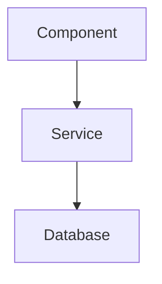

# Feature Name

## Goal

A clear, single-sentence statement of what this feature achieves and why it matters.

## User Stories

- As a [user type], I want [action] so that [benefit]
- As a [user type], I want [action] so that [benefit]

## Specific Requirements

### Functional Requirements

1. The system must...
2. Users should be able to...
3. When [trigger], then [outcome]

### Non-Functional Requirements

- Performance: Response time < X ms
- Security: [requirements]
- Accessibility: WCAG 2.1 AA compliance

## Visual Design

### UI Components

- [ ] Component A - Description
- [ ] Component B - Description

### User Flow

```
[Start] → [Step 1] → [Step 2] → [End State]
```

### Mockups

<!-- Link to Figma/design files or embed diagrams -->

## Technical Approach

### Architecture



### Key Implementation Details

1. **Data Model**: Describe schema changes
2. **API Endpoints**: List new/modified endpoints
3. **State Management**: How state flows through the system

### Technology Choices

| Choice | Rationale |
|--------|-----------|
| Library X | Because... |

## Out of Scope

- Feature A (planned for future)
- Edge case B (not supported in v1)
- Integration C (separate spec needed)

## Open Questions

- [ ] Question 1?
- [ ] Question 2?

## References

- [Related Spec](./related-spec.md)
- [External Documentation](https://...)
