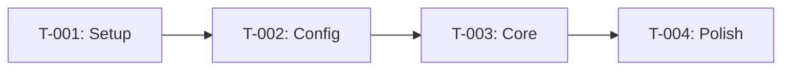

# Tasks: Feature Name

## Overview

| Metric | Value |
|--------|-------|
| Total Tasks | X |
| Estimated Effort | X hours |
| Dependencies | List |

## Task Groups

### Group 1: Foundation Setup

**Dependencies:** None
**Estimated:** X hours

#### Task 1.1: [Task Name]

- **ID:** T-001
- **Priority:** High
- **Estimate:** 1h
- **Tests Required:** Unit tests for [component]

**Sub-tasks:**
- [ ] Sub-task A
- [ ] Sub-task B
- [ ] Sub-task C

**Acceptance Criteria:**
- [ ] Criteria 1
- [ ] Criteria 2

---

#### Task 1.2: [Task Name]

- **ID:** T-002
- **Priority:** High
- **Estimate:** 2h
- **Tests Required:** Integration tests

**Sub-tasks:**
- [ ] Sub-task A
- [ ] Sub-task B

**Acceptance Criteria:**
- [ ] Criteria 1

---

### Group 2: Core Implementation

**Dependencies:** Group 1
**Estimated:** X hours

#### Task 2.1: [Task Name]

- **ID:** T-003
- **Priority:** High
- **Estimate:** 3h
- **Tests Required:** Unit + E2E tests

**Sub-tasks:**
- [ ] Sub-task A
- [ ] Sub-task B
- [ ] Sub-task C
- [ ] Sub-task D

**Acceptance Criteria:**
- [ ] Criteria 1
- [ ] Criteria 2
- [ ] Criteria 3

---

### Group 3: Integration & Polish

**Dependencies:** Group 2
**Estimated:** X hours

#### Task 3.1: [Task Name]

- **ID:** T-004
- **Priority:** Medium
- **Estimate:** 1h
- **Tests Required:** Visual regression

**Sub-tasks:**
- [ ] Sub-task A
- [ ] Sub-task B

**Acceptance Criteria:**
- [ ] Criteria 1

---

## Dependency Graph

## Test Coverage Plan

| Task | Unit | Integration | E2E |
|------|------|-------------|-----|
| T-001 | ✓ | | |
| T-002 | ✓ | ✓ | |
| T-003 | ✓ | ✓ | ✓ |
| T-004 | | | ✓ |

## Progress Tracking

| Task | Status | Started | Completed | Notes |
|------|--------|---------|-----------|-------|
| T-001 | ⬜ Pending | | | |
| T-002 | ⬜ Pending | | | |
| T-003 | ⬜ Pending | | | |
| T-004 | ⬜ Pending | | | |

**Legend:** ⬜ Pending | 🟡 In Progress | ✅ Complete | ❌ Blocked
